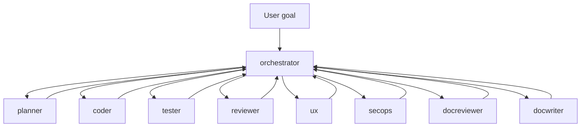

# AGENTS — Cursor team layout

This repository defines a **hub-and-spoke** subagent team for Cursor. Subagents live in `.cursor/agents/`; shared procedures live in `.cursor/skills/`. A **portable mirror** plus a **how-to guide** (creating agents/skills, research extensions, syncing) lives in **[agents_and_skills/README.md](agents_and_skills/README.md)**.

## Quick use

- Invoke explicitly: `/orchestrator …`, `/planner …`, `/coder …`, etc. (see [Cursor Subagents](https://cursor.com/docs/context/subagents)).
- Ask the main Agent to **delegate** using these roles; the **orchestrator** description is tuned for proactive routing on complex work.

## Roles and artifacts

| Role | Primary outputs | Notes |
|------|-----------------|--------|
| orchestrator | Assignments, sequencing, `VERSION` / `CHANGELOG.md` only | No product code |
| planner | `plans/*.md` | Checklists, phases, questions for user |
| coder | Source, tests when planned | Updates plan checkboxes |
| ux | UX assessment | Playwright, screenshots |
| reviewer | Review verdict, plan checkbox updates | Lints |
| secops | `assessments/security-assessment-*.md` | Scans, findings |
| tester | `logs/test-ledger.md` | No source/test edits to fix failures |
| docreviewer | `logs/docs_log-*.md` | Does not edit product files |
| docwriter | Docs under `docs/`, `README`, etc. | Then suggest docreviewer |

## Skills map

| Skill folder | Used by |
|--------------|---------|
| `team-orchestration-delegation` | orchestrator |
| `plans-folder-authoring` | planner |
| `coder-implementation-standards` | coder |
| `ux-evaluation-web` | ux |
| `reviewer-spec-alignment` | reviewer |
| `security-scanning-secops` | secops |
| `test-ledger-runner` | tester |
| `documentation-review-write-handoff` | docreviewer, docwriter |
| `python-venv-dependencies` | any role running Python tooling |

Subagent files include a **“Load these skills”** section; the Agent should read those skill folders when executing that role.

## Flow (typical)

Parallel branches (e.g. **tester** + **secops**) are fine when they do not race on the same files or dependency manifests—**orchestrator** decides.

## Moving to global Cursor config

Copy to your user directory (same structure):

- `.cursor/agents/*.md` → `~/.cursor/agents/`
- `.cursor/skills/*/` → `~/.cursor/skills/`

Project-level definitions **override** user-level on name conflicts. Keep repo-specific paths (`plans/`, `logs/`, `assessments/`) in plans or orchestration notes when you globalize.

## Related notes in this repo

- [info/agent-orchestration-and-skills-guide.md](info/agent-orchestration-and-skills-guide.md) — broader orchestration and skills ecosystem context.
