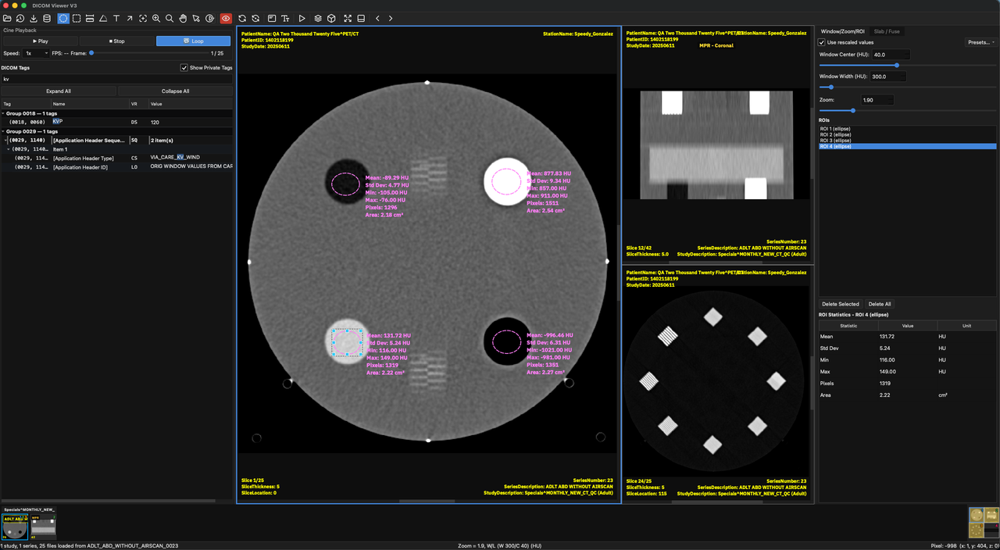
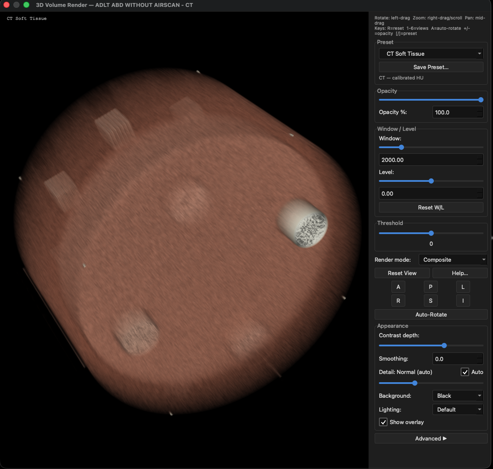
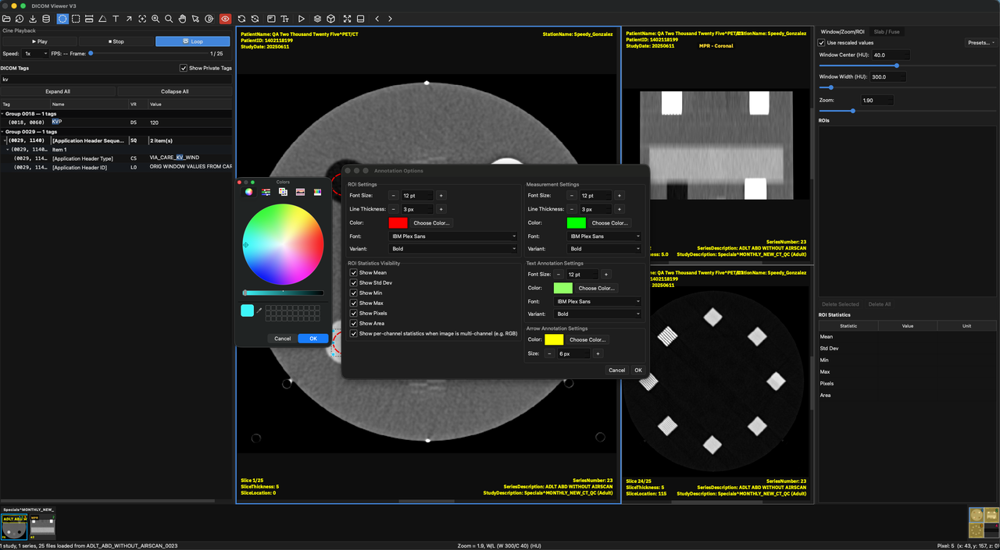
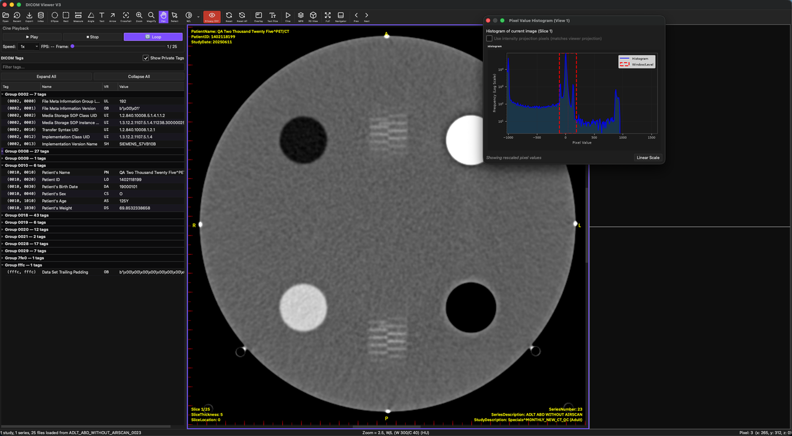
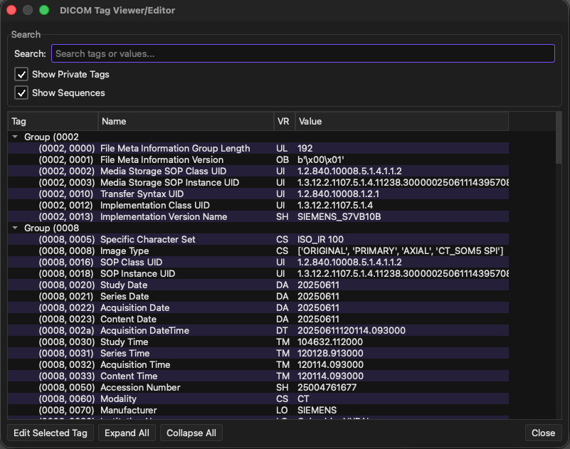
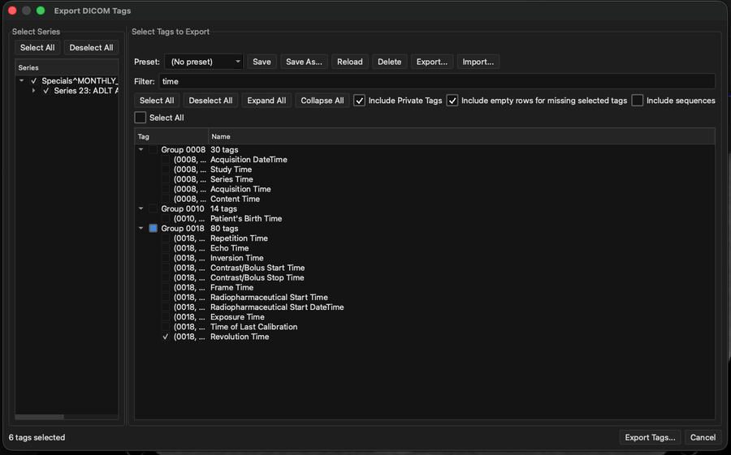
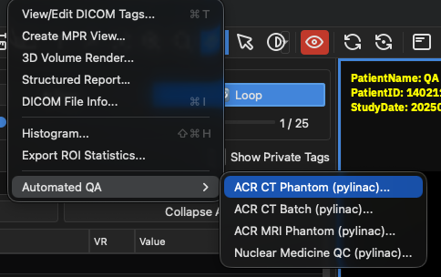

# DICOM Viewer V3

DICOM Viewer V3 is a cross-platform desktop application for reviewing medical
imaging studies locally on Windows, macOS, and Linux. Open studies from files
or folders, review them with multi-window viewing and clinical measurement
tools, and export images or derived DICOM — all on your own machine. It is not
a PACS server or archive.

  

<em>Multi-pane review with ROIs, MPR, cine playback, and an integrated tag viewer.</em>

## Get the app

Download a packaged release for your platform from the
[releases page](https://github.com/kgrizz-git/DICOMViewerV3/releases) and run
the installer or bundle. Inside the app, **Help → Quick Start Guide** gives a
short orientation and **Help → Documentation** opens the full user guide.

## Highlights

| Area | Capabilities |
| --- | --- |
| Viewing | Multi-pane layouts, window/level presets, slice navigation, cine playback, series navigator, configurable overlays, themes and settings. |
| Reconstruction | Create and export MPRs; slab / intensity projections (AIP, MIP, MinIP); optional 3D volume rendering with presets and display controls. |
| Clinical tools | ROIs with live statistics, distance/angle measurements, text and arrow annotations, pixel histogram, collapsible tag viewer, and DICOM tag editing. |
| Fusion | PET/SPECT overlays on CT or MR with opacity, alignment, and display controls. |
| Export | Images and screenshots, cine video, derived DICOM (including MPR), tags, ROI statistics, and structured reports. |
| QA (optional) | Automated ACR CT, ACR MRI, and nuclear-medicine phantom workflows powered by [pylinac](https://pylinac.readthedocs.io/). |

Studies opened locally are indexed into an encrypted local study database so
you can find and reopen them quickly.

## Feature gallery

Screenshots below use QC phantom studies (no patient PHI). Display width is
constrained for readability; full assets live under
`resources/readme-screenshots/`.

<table>
  <tr>
    <td align="center" valign="top" width="50%">
       
      <em>Optional 3D volume rendering with presets and display controls.</em>
    </td>
    <td align="center" valign="top" width="50%">
       
      <em>Customize ROI, measurement, and annotation appearance.</em>
    </td>
  </tr>
  <tr>
    <td align="center" valign="top" width="50%">
       
      <em>Pixel-value histogram alongside cine and tag inspection.</em>
    </td>
    <td align="center" valign="top" width="50%">
       
      <em>Search, inspect, and edit DICOM tags.</em>
    </td>
  </tr>
  <tr>
    <td align="center" valign="top" width="50%">
       
      <em>Export selected DICOM tags with presets and filters.</em>
    </td>
    <td align="center" valign="top" width="50%">
       
      <em>Automated CT, MR, and nuclear-medicine QC with pylinac.</em>
    </td>
  </tr>
</table>

## Documentation for users

- [User guide](user-docs/USER_GUIDE.md)
- [Configuration](user-docs/CONFIGURATION.md)
- [Change log](CHANGELOG.md)

## Run from source

Clone the repository, then double-click [`launch.bat`](launch.bat) (Windows) or
run `bash launch.command` (macOS/Linux). The launcher creates a virtual
environment if needed, installs dependencies, and starts the viewer.

Prefer a manual setup, hit a launcher problem, or want tests and tooling? See
[dev-docs/DEVELOPER_SETUP.md](dev-docs/DEVELOPER_SETUP.md).

## Contributing and project layout

Contributions start with [dev-docs/CONTRIBUTING.md](dev-docs/CONTRIBUTING.md);
architecture lives in [ARCHITECTURE.md](ARCHITECTURE.md), and the full
developer documentation index is [dev-docs/README.md](dev-docs/README.md).
Source is under `src/`, user guides under `user-docs/`, contributor docs and
plans under `dev-docs/`.
