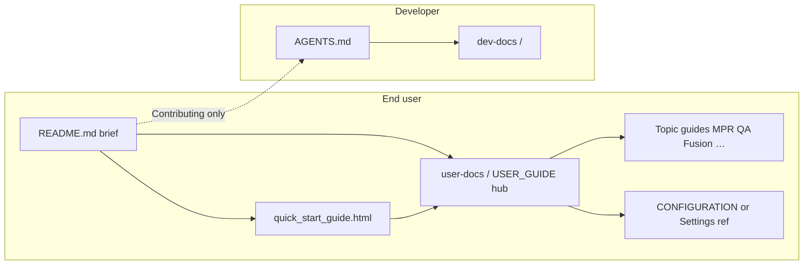

# Documentation Assessment - DICOM Viewer V3

**Source template**: `dev-docs/templates-generalized/doc-assessment-template.md` (template header **Version 3.0**; footer still lists **Version 2.1** — metadata drift on the master template only; not edited per assessment-only rules).

## Assessment Date

- **Date**: 2026-04-20
- **Time**: 00:22:24 (local, from filename)
- **Assessor**: AI Agent (Cursor)

## Preparation Checklist

- [x] Create timestamped copy of this template → this file (`dev-docs/doc-assessments/doc-assessment-2026-04-20-002224.md`)
- [x] **Only this assessment file was edited** — no changes to application code or project documentation during this run
- [x] Identify documentation files (**including** non-Markdown bundled help)
- [x] Cross-reference key claims against code / repo layout (sampled; not every checklist line item exhaustively line-audited)
- [x] Record findings using the template’s results structure

---

## Documentation Files Reviewed

### Summary Table

| File | Type | Status | Issues Found | Notes |
|------|------|--------|--------------|-------|
| `README.md` | User-facing | Reviewed | 1 (completion) | Accurate for install/run/structure vs current tree; omits some shipped features |
| `resources/help/quick_start_guide.html` | User-facing (bundled) | Reviewed | 1 (completion / terminology) | Matches Help wiring; slightly less precise than hub on Space/overlay |
| `user-docs/USER_GUIDE.md` | User-facing (hub) | Reviewed | 1 (completion) | Strong hub + deep bullets; local study index not mentioned |
| `user-docs/USER_GUIDE_MPR.md` | User-facing | Not deep-reviewed | — | Linked from hub; deferred |
| `user-docs/USER_GUIDE_QA_PYLINAC.md` | User-facing | Not deep-reviewed | — | Linked from hub; deferred |
| `user-docs/IMAGE_FUSION_TECHNICAL_DOCUMENTATION.md` | User/technical | Not deep-reviewed | — | Linked from hub + HTML; deferred |
| `resources/help/fusion_technical_doc.html` | User-facing (bundled) | Inventory only | — | Paired with fusion docs; deferred |
| `CHANGELOG.md` | User-facing | Spot-checked | 0 | Sampled recent entries |
| `AGENTS.md` | Contributor / agent | Sampled | 0 major | Aligns with README on venv, `python src/main.py`, tests |
| `dev-docs/DEVELOPER_SETUP.md` | Developer | Inventory | — | README links correctly |
| `dev-docs/CODE_DOCUMENTATION.md` | Developer | Spot-checked | 0 | Quick Start now correctly points to `resources/help/quick_start_guide.html` (prior assessment issue appears **resolved**) |
| `GETTING_STARTED.md` | — | **N/A** | — | Not present; README covers onboarding |
| `user-docs/CONFIGURATION.md` | — | **N/A** | — | Not present; options in `src/utils/config/*` |
| `dev-docs/TECHNICAL_DETAILS.md` | — | **N/A** | — | Not present; split across `AGENTS.md`, `dev-docs/info/*`, plans |

### Prior assessment delta (`doc-assessment-2026-04-03-111903.md`)

- That run stated there was **no** `user-docs/USER_GUIDE.md`. As of this assessment, **`user-docs/USER_GUIDE.md` exists** as a topic hub with substantial “General viewing (2D)” content. README and in-app **Help → Documentation** correctly target it via `src/utils/doc_urls.py` (`user_guide_hub_url()`).
- That run flagged **README** “project structure” listing `docs/` / `data/` and duplicate bullets — the **current** `README.md` (73 lines) shows a **correct** tree (`src/`, `tests/`, `user-docs/`, `dev-docs/`, `resources/`, `scripts/`, `.github/`) and no longer contains those structural errors.

---

## Detailed Findings

### File: `README.md`

**Location**: `README.md`  
**Type**: User-facing  
**Status**: Accurate for sampled areas; **completion** gap for some user-visible features

#### Accuracy Issues

None material found in this pass for: Python version guidance, `pip install -r requirements.txt`, `python src/main.py` / `python -m src.main`, `launch.bat` venv order (`venv` → `.venv` → `env` → `virtualenv`, per `launch.bat` lines 6–9), pylinac pin **3.42.0** vs `requirements.txt` line 37, project structure block vs repository root.

#### Completion Issues

##### Missing documentation: Local study index (encrypted)

**Location in Code**: e.g. `src/gui/dialogs/settings_dialog.py` (“Local study index (encrypted)” group ~lines 73–95); `src/core/study_index/` per `AGENTS.md` module map  
**What’s missing**: End-user / README coverage of the **local encrypted study database**, settings under preferences, and how it relates to opening files (auto-add on open, DB path).

**Impact**: Medium — feature is called out for developers in `AGENTS.md` but not in `README.md` or the `user-docs/USER_GUIDE.md` hub sampled in this pass.

**Suggested documentation**: Add a short bullet under README “Overview” or “Documentation” cross-links, and/or a subsection in `USER_GUIDE.md` pointing to Settings.

#### Accurate and Complete Sections (sampled)

- Documentation section correctly describes **Help → Quick Start Guide**, **Help → Documentation** (browser), and `user-docs/` topic layout.
- Technology stack summary matches major dependencies in `requirements.txt` (PySide6, pydicom, pylinac pin, imageio/ffmpeg note).

---

### File: `resources/help/quick_start_guide.html`

**Location**: `resources/help/quick_start_guide.html`  
**Type**: User-facing (bundled)  
**Status**: Accurate for navigation / Help parity; minor **completion / wording** vs hub

#### Agreement / completion

- **Placeholder links** `{doc_USER_GUIDE}`, etc., are filled by `QuickStartGuideDialog` / `doc_urls.user_doc_url` — consistent with **Help → Documentation** opening the same GitHub prefix (`src/utils/doc_urls.py` lines 17–19).
- **Keyboard**: HTML says **Space** — “cycle overlay visibility” (`quick_start_guide.html` ~line 69). **`user-docs/USER_GUIDE.md`** documents Space as cycling **Simple → Detailed → Hidden** on **all** panes and mentions **Shift+Space** for focused-pane behavior.

**Impact**: Low — not contradictory, but Quick Start could add one clause to match hub precision.

#### Accurate cross-references (sampled)

- Table of contents, opening studies, layouts (1x1, 1x2, 2x1, double-click), swap, W/L, privacy (**Ctrl+P** / **Cmd+P**), tools menu paths — consistent with application patterns described in `AGENTS.md` / `main.py` menu handlers.

---

### File: `user-docs/USER_GUIDE.md`

**Location**: `user-docs/USER_GUIDE.md`  
**Type**: User-facing (hub + general 2D topics)  
**Status**: Strong agreement with code for SR browser, ROI export, screenshots, overlays (sampled against `main.py` SR flow); **completion** gap same as README for **local study index**

#### Accurate and Complete Sections (sampled)

- Structured Report browser bullet aligns with `DICOMViewerApp._open_structured_report_browser` behavior (MPR guard, modality checks).
- Cine export formats (GIF, AVI, MP4 MPEG-4 Part 2, MPG) match README and AGENTS notes.
- Source/versioning note references `main` branch GitHub URL consistent with `doc_urls.py` default prefix.

---

### File: `src/utils/doc_urls.py` (in-app documentation wiring)

**Location**: `src/utils/doc_urls.py`  
**Type**: Code (documentation URL contract)  
**Status**: Accurate vs README

`USER_DOCS_GITHUB_PREFIX` targets `.../blob/main/user-docs` — matches `USER_GUIDE.md` statement that files track **main**.

---

### File: `AGENTS.md`

**Location**: `AGENTS.md`  
**Type**: Contributor  
**Status**: Accurate (sampled)

Module layout including `core/study_index/` matches repository; venv and test commands align with README.

---

## Code-to-Documentation Gaps

### Undocumented features (user-facing emphasis)

1. **Local study index (SQLCipher MVP)**  
   - **Location**: `src/core/study_index/`, settings in `settings_dialog.py`  
   - **Impact**: Medium  
   - **Suggested documentation**: `USER_GUIDE.md` hub + optional README one-liner; link to `dev-docs/plans/supporting/LOCAL_STUDY_DATABASE_AND_INDEXING_PLAN.md` for deep dive if desired

### Undocumented configuration options

Not exhaustively enumerated in this run (no `CONFIGURATION.md`). **Recommendation** (Phase 2): either add `user-docs/CONFIGURATION.md` or maintain a “Settings reference” section in `USER_GUIDE.md` keyed to `src/utils/config/*` keys.

---

## Cross-Documentation Consistency

| Topic | Observation |
|------|---------------|
| Python / venv / run | README ↔ AGENTS **consistent** |
| pylinac **3.42.0** | README ↔ requirements.txt **consistent** |
| Help → Documentation URL | README ↔ `doc_urls.py` ↔ USER_GUIDE hub **consistent** |
| Quick Start **Space** wording | `quick_start_guide.html` less specific than `USER_GUIDE.md` — **minor** terminology gap |
| Master doc-assessment template | Header “Template Version **3.0**” vs footer “**Version**: 2.1” — **internal template inconsistency** (record only; master not edited) |

---

## Documentation Purpose and Organization

### Observations

- **README** remains appropriately brief for a modern README while pointing to `user-docs/` and in-app Help.
- **`USER_GUIDE.md`** now fulfills part of the generic template’s “USER_GUIDE” role as a **hub** plus rich general sections; topic splits (MPR, QA, fusion) reduce monolith size.
- **No** standalone `GETTING_STARTED.md` / `CONFIGURATION.md` / `TECHNICAL_DETAILS.md` is still acceptable if intentional; gap is **discoverability** of advanced settings (study index) without a config reference doc.

### Organization issues

- **Low**: Consider a dedicated short **“Settings & privacy”** section in the hub that lists major Settings groups (including study index) with pointers—reduces reliance on exploratory UI discovery.

---

## Prioritized Recommendations

### High priority

None identified in this pass (no incorrect install paths or broken structural claims in current README).

### Medium priority

1. **Document local study index** for end users — README and/or `USER_GUIDE.md`; align with Settings UI labels.  
   - **Code**: `src/gui/dialogs/settings_dialog.py`, `src/core/study_index/`  
   - **Fix**: Short user-facing description + where to configure.

2. **Optional**: Expand Quick Start HTML **Space** bullet to mirror `USER_GUIDE.md` (Simple / Detailed / Hidden, Shift+Space).  
   - **Docs**: `resources/help/quick_start_guide.html`  
   - **Fix**: One sentence alignment.

### Low priority

1. Reconcile **master** `doc-assessment-template.md` version metadata (header vs footer) when editing the template in Phase 2.  
2. Periodic deep read of `USER_GUIDE_MPR.md`, `USER_GUIDE_QA_PYLINAC.md`, and fusion MD vs menus/toolbars.

---

## Summary Statistics

- **Total documentation files reviewed (meaningful pass)**: 6 (`README.md`, `USER_GUIDE.md`, `quick_start_guide.html`, `CHANGELOG.md` spot, `AGENTS.md` sample, `CODE_DOCUMENTATION.md` spot)
- **Total issues found**: 4 (1 completion README, 1 completion USER_GUIDE overlap, 1 Quick Start wording, 1 template metadata note)
- **Accuracy issues**: 0 material (this pass)
- **Agreement issues**: 1 minor (Space / overlay wording)
- **Completion issues**: 2 (study index; general “no CONFIGURATION.md” remains)
- **High / Medium / Low priority**: 0 / 2 / 2

---

## Recommended documentation architecture (end-users vs developers)

This section responds to the goal of **clear separation** between audiences, **comprehensive** coverage without duplication chaos, **accuracy** (code as source of truth), and **easy discovery**—including a **Quick Guide** that surveys major features and shortcuts then defers to topic docs.

### 1. Split the corpus into two visible “trees”

| Audience | Primary location | Purpose |
|----------|------------------|---------|
| **End users** | `user-docs/` + bundled `resources/help/*.html` | Install/run (where relevant), workflows, menus, shortcuts, settings behavior, troubleshooting **without** requiring repo layout knowledge |
| **Developers & contributors** | `AGENTS.md` (entry) + `dev-docs/` | Build from source, tests, CI, module map, plans, releasing, security tooling, deep technical notes |

**Convention:** Root `README.md` stays a **short billboard**: what the app is, how to get binaries (if published), one paragraph for “run from source,” and **two explicit links**: “User documentation” → `user-docs/USER_GUIDE.md` (or a tiny `user-docs/README.md` index), “Developer documentation” → `AGENTS.md` + `dev-docs/DEVELOPER_SETUP.md`. Avoid mixing long developer-only detail in the same file as end-user workflows.

### 2. End users: two consumption modes (binary vs source)

Treat them as **overlapping** audiences with different “first mile” needs:

- **Compiled binary / installer users**  
  - Need: first launch, where data goes, privacy, updates, platform quirks (Windows Store codecs, macOS quarantine, Linux AppImage), and **in-app Help** that works **offline** for basics.  
  - **Suggestion:** Keep **`resources/help/quick_start_guide.html`** as the **offline** anchor (short, stable, ships with the app). It should **not** duplicate long prose; it should match the **Quick Guide** outline below and link to full docs (browser URLs from `doc_urls.py`, or future bundled HTML chunks if you ever want fully offline deep docs).

- **Run-from-source users**  
  - Need: Python version, venv, `pip install -r requirements.txt`, `python src/main.py`, optional `launch.bat`, link to **same** user docs as binaries.  
  - **Suggestion:** Keep this in `README.md` + `AGENTS.md`; optionally add **`user-docs/INSTALL_FROM_SOURCE.md`** only if README grows crowded—single place for “clone → venv → run → test” so README stays thin.

**Accuracy rule:** Any statement that differs between binary and source (paths, “no Python required,” update channel) should live in a **small dedicated subsection** or table so one audience is not misled by the other.

### 3. Quick Guide vs full documentation (your requested shape)

**Quick Guide** (single conceptual product, possibly two delivery surfaces):

1. **In-app / bundled:** `resources/help/quick_start_guide.html` — mandatory for discoverability inside the app; optimized for scanning (headings, bullets, TOC).  
2. **Optional mirror on GitHub:** e.g. `user-docs/QUICK_GUIDE.md` — same outline as the HTML, maintained once if you **generate** HTML from Markdown in CI, *or* maintained twice if you keep hand-authored HTML (then add a **checklist in releasing** to edit both).

**Recommended Quick Guide table of contents** (each section 5–15 lines, then “Learn more →” links):

| Section | Covers | Links out to |
|---------|--------|----------------|
| Opening data | File/folder, navigator, series | Full hub “General viewing” |
| Layouts & focus | 1x1, 1x2, 2x1, swap, double-click | `USER_GUIDE` or dedicated layout doc if split later |
| Window/level & display | Presets, invert, smoothing | Hub / overlay section |
| Privacy | What is masked, toggle | Hub |
| Overlays & corner tags | Space / Shift+Space, overlay config | Hub (keep wording **identical** to hub to avoid drift) |
| Tools | ROI, measure, annotations, keys H R E M… | Hub + tools appendix if needed |
| MPR / Fusion / QA | One paragraph each + menu path | `USER_GUIDE_MPR.md`, fusion doc, `USER_GUIDE_QA_PYLINAC.md` |
| Export & SR | Export images/cine/tags; SR browser | Hub bullets |
| Settings | High-level list of **Settings** groups (incl. study index) | `CONFIGURATION.md` or hub “Settings reference” |
| Shortcuts | Table of top 20 shortcuts | Full list appendix in hub or `USER_GUIDE_SHORTCUTS.md` if it grows |

**Full documentation:** `user-docs/USER_GUIDE.md` remains the **hub** with a **stable “Topics” table** at the top; long vertical sections move to **topic files** you already have (MPR, QA, fusion). Add new topic files when a single section would exceed ~400–500 lines.

### 4. Navigation and discoverability

- **Single hub:** `user-docs/USER_GUIDE.md` is the canonical **“start here for humans”** URL for Help → Documentation (already aligned with `doc_urls.py`). At the top, add a **one-line map**: “Quick orientation → Quick Start in app (Help menu) | This hub | Changelog | Report issues.”  
- **Consider** `user-docs/README.md` as a **second index** only if you want GitHub’s folder view to show a landing page; otherwise avoid duplication—link from repo README only to `USER_GUIDE.md`.  
- **Developer index:** Add **`dev-docs/README.md`** (if missing) that lists categories: setup, releasing, security, plans, info deep-dives, assessments—with **no** end-user workflow prose.  
- **Cross-links:** End-user docs should rarely link into `dev-docs/plans/`; when they must, label them “Advanced / background” so casual users do not land in unfinished plans.  
- **Released builds:** For `doc_urls.py`, consider documenting (for maintainers) a pattern: **default branch for living docs** vs **tag URLs for release-matched docs** when behavior diverges—reduces “main says X but my binary is vY” confusion.

### 5. Settings and configuration (accuracy + structure)

Introduce **`user-docs/CONFIGURATION.md`** (or a major `USER_GUIDE.md` section **Settings reference**) that:

- Lists each **Settings** dialog group in UI order with **user-visible** names matching the UI strings.  
- For each option: effect, default, persistence key name **only if** useful for support (optional column).  
- Implementation detail stays in `dev-docs/info/` or code comments; user doc links there only for “why” or DICOM nuance.

Generate or verify this table periodically from `src/utils/config/*` in a **doc maintenance** task (script or checklist in `RELEASING.md`) so it does not rot.

### 6. Developer docs: keep `AGENTS.md` bounded

- **`AGENTS.md`:** Venv, run, test, high-level `src/` map, CI pointers, agent/orchestration rules—**operational** knowledge.  
- **`dev-docs/CODE_DOCUMENTATION.md`:** Where to find dialogs, help loaders, major controllers—**orientation** for touching code.  
- **`dev-docs/info/*`:** Domain deep-dives (pylinac, fusion, licensing).  
- **`dev-docs/plans/*`:** Intent and history; not a substitute for user docs.

If `AGENTS.md` grows past comfort, **split** into `AGENTS.md` + `dev-docs/CONTRIBUTING.md` for PR hygiene and leave `AGENTS.md` as the AI/agent contract.

### 7. Quality gates (keep structure honest)

- **Link check** on CI for `user-docs/*.md` relative links + optional lychee for external URLs.  
- **Doc assessment cadence:** Re-run the doc-assessment template after releases or large UI changes.  
- **Single source of truth:** Shortcuts and menu paths should be defined in **one** user-facing place; Quick Guide HTML should **link or quote** that place—not invent parallel wording (reduces the Space/overlay-type drift noted above).

### 8. Summary diagram (information flow)

---

## Next Steps

- [ ] Review findings with maintainers; prioritize study index user doc
- [ ] Phase 2: documentation updates only (separate commits from assessments)
- [ ] Optionally refresh `doc-assessment-template.md` version footer to match 3.0
- [ ] After updates, run a new timestamped assessment to close the loop
