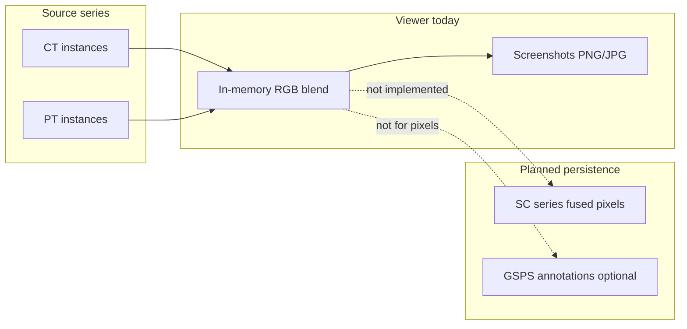

# DICOM GSPS, Key Object Selection, and Secondary Capture

**Purpose:** Maintainer reference for three DICOM object types that often come up when planning **export**, **PACS interchange**, and **fusion save**. Covers what each object is, what it is good for, how DICOM Viewer V3 **reads** and **displays** them today, and what **writing** would mean.

**Last updated:** 2026-05-22

**Related:**

- [KO_PR_OVERLAYS_EXPLANATION.md](KO_PR_OVERLAYS_EXPLANATION.md) — embedded overlays and PR/KO overview (older doc; this file is the canonical place for GSPS/KO/SC + app status)
- [HIGHDICOM_OVERVIEW.md](HIGHDICOM_OVERVIEW.md) — optional library for authoring GSPS/SR/SEG (`highdicom.pr`, etc.)
- [IMAGE_FUSION_TECHNICAL_DOCUMENTATION.md](../../user-docs/IMAGE_FUSION_TECHNICAL_DOCUMENTATION.md) — on-screen fusion (not DICOM export)
- TO_DO: [Save fused view as DICOM](../TO_DO.md#dicom-write--pacs-interchange-annotations--derived-objects), [Export GSPS](../TO_DO.md#dicom-write--pacs-interchange-annotations--derived-objects), [Export KO](../TO_DO.md#dicom-write--pacs-interchange-annotations--derived-objects)

---

## Quick comparison

| | **GSPS** (Grayscale Softcopy Presentation State) | **KO** (Key Object Selection Document) | **SC** (Secondary Capture Image) |
|---|---------------------------------------------------|----------------------------------------|----------------------------------|
| **What it is** | Separate **metadata** object referencing source images; stores **how to present** them + **graphic layers** | Separate **metadata** object listing **key** instances + structured content (often SR-style tree) | A **real image** SOP instance (pixel data + image IOD) |
| **Typical SOP Class UID** | `1.2.840.10008.5.1.4.1.1.11.1` (grayscale); `…11.2` (color) | `1.2.840.10008.5.1.4.1.1.88.59` | `1.2.840.10008.5.1.4.1.1.7` (Secondary Capture Image Storage) |
| **Stores pixels?** | No — references other instances | No — references other instances | **Yes** |
| **Good for** | User annotations, W/L/zoom/pan presentation, graphic ROIs on referenced slices | “Key images” lists, structured findings, PACS worklists of important instances | Derived/exported **pictures**, screenshots, reformats, fused composites, MPR stacks |
| **Read in app?** | **Yes** (parse only) | **Yes** (parse only) | **Yes** (as normal image series) |
| **Displayed in app?** | **Yes** — graphics overlaid when UIDs match | **Partial** — text-oriented KO content, coarse placement | **Yes** — standard 2D viewer pipeline |
| **Written by app today?** | **No** | **No** | **Yes** — MPR export only (derived series); not fusion |
| **Planned TO_DO** | [Export GSPS](../TO_DO.md#dicom-write--pacs-interchange-annotations--derived-objects) (P2) | [Export KO](../TO_DO.md#dicom-write--pacs-interchange-annotations--derived-objects) (P3) | [Save fused view as DICOM](../TO_DO.md#dicom-write--pacs-interchange-annotations--derived-objects) (P2, SC path) |

---

## Grayscale Softcopy Presentation State (GSPS)

In the codebase and older docs this is often called **PR** (presentation state) or **Presentation State**. DICOM’s formal name for the common grayscale type is **Grayscale Softcopy Presentation State** (GSPS). **Color** softcopy presentation state (`…11.2`) uses the same general model with color-specific modules.

### What it is and how it works

- A **standalone DICOM file** in the same study (usually) as the images it applies to.
- Does **not** contain diagnostic pixel data for the anatomy; it contains:
  - **References** to source images (`ReferencedImageSequence` per instance, or `ReferencedSeriesSequence` for a whole series).
  - **GraphicAnnotationSequence** — polylines, circles, ellipses, text, points (with coordinates in PIXEL, DISPLAY, or other units).
  - Optional **presentation** attributes: window center/width, displayed area (zoom/pan crop), rotation, shutters, etc.
- PACS applies GSPS when displaying the referenced image: same underlying pixels, plus presentation state and graphics.

### What it is good for

- **Round-tripping radiologist graphics** to other DICOM viewers (arrows, ROI outlines, distance lines, text).
- **Storing display intent** (W/L, zoom, pan) separate from the source acquisition.
- **One GSPS** can reference **many** instances or an entire series (series-level reference applies graphics to all slices in that series in this viewer).

### What it is *not* good for

- **Saving PET/CT fusion** or any new composite pixel matrix — GSPS does not store blended color PET on CT; it only annotates or presents **existing** referenced images.
- **Full structured reporting** (coded findings, TID 1500 measurements) — use **SR** for that; see [HIGHDICOM_OVERVIEW.md](HIGHDICOM_OVERVIEW.md).

### Read and display in DICOM Viewer V3

| Step | Implementation |
|------|----------------|
| **Detect on load** | [`dicom_organizer.py`](../../src/core/dicom_organizer.py) — SOP Class `11.1` / `11.2`; files are **not** added to image series lists |
| **Store per study** | `DicomOrganizer.presentation_states` → passed to [`annotation_manager.py`](../../src/tools/annotation_manager.py) |
| **Parse** | [`presentation_state_handler.py`](../../src/core/presentation_state_handler.py) — `GraphicAnnotationSequence`, referenced UIDs, display settings |
| **Match to slice** | `AnnotationManager.get_annotations_for_image()` — match `SOPInstanceUID` or `SeriesInstanceUID` |
| **Render** | `AnnotationManager.create_presentation_state_items()` — QGraphics items on the image scene (alongside native ROIs/measurements) |

**Not applied today from GSPS:** automatic change of viewer W/L/zoom from `parse_display_settings()` when opening a slice (graphics are merged; display settings from PS are parsed but not fully driving the main viewer state).

**Color GSPS:** detected and parsed through the same path; graphic types and color handling follow the same annotation pipeline.

### Export / save (not implemented)

There is **no** “Save as Presentation State” menu item and **no** GSPS writer module.

A future **Export GSPS** feature ([TO_DO](../TO_DO.md#dicom-write--pacs-interchange-annotations--derived-objects)) would likely:

1. Collect in-viewer annotations (ROIs, measurements, text, arrows) that can map to DICOM graphic types.
2. Build a new dataset with a **new SOP Instance UID**, referencing each affected source `SOPInstanceUID`.
3. Write `GraphicAnnotationSequence` (and optionally `DisplayedAreaSelectionSequence`, W/L tags).
4. Save into the study folder (or user-chosen directory) with **Explicit VR Little Endian** transfer syntax.
5. Support **anonymize** and **privacy** rules consistent with other exports.

**Implementation options:** hand-built pydicom (like [`mpr_dicom_export.py`](../../src/core/mpr_dicom_export.py)), or **highdicom** `highdicom.pr` ([overview](HIGHDICOM_OVERVIEW.md)).

**Scope decisions for a plan:** per-slice vs one GSPS per series; which tools export (native ROI vs measurement vs arrow); coordinate system (PIXEL vs DISPLAY); whether to export viewer W/L as presentation state.

---

## Key Object Selection (KO) Document

### What it is and how it works

- A **Key Object Selection Document** is a DICOM SOP (often treated like a lightweight SR-style document) that marks a set of images as **significant** (“key images”).
- Structure (simplified):
  - **CurrentRequestedProcedureEvidenceSequence** / nested **ContentSequence** — tree of items.
  - **ReferencedSOPSequence** — points at `StudyInstanceUID`, `SeriesInstanceUID`, `SOPInstanceUID`.
  - May include **TEXT**, **NUM**, and concept codes (what the finding is), not necessarily full graphic geometry.

Think of KO as a **curated index** plus structured narrative/measurements, not a substitute for a presentation state file with polylines and circles.

### What it is good for

- Radiologist **key-image** workflows in PACS.
- Packaging **which instances matter** for a report or handoff.
- Attaching **structured labels** or numeric values tied to referenced instances.

### What it is *not* good for

- **Precise graphic interchange** (arrow tip at pixel (412, 288)) — prefer **GSPS**.
- **Fusion pixel export** — KO does not store rendered overlay pixels.
- **Replacing SR** for comprehensive measurement reports.

### Read and display in DICOM Viewer V3

| Step | Implementation |
|------|----------------|
| **Detect on load** | [`dicom_organizer.py`](../../src/core/dicom_organizer.py) — SOP Class `88.59`; excluded from image series |
| **Store per study** | `DicomOrganizer.key_objects` → `AnnotationManager.load_key_objects()` |
| **Parse** | [`key_object_handler.py`](../../src/core/key_object_handler.py) — `ContentSequence`, referenced UIDs |
| **Match to slice** | `AnnotationManager.get_annotations_for_image()` — if `SOPInstanceUID` is in KO references |
| **Render** | KO entries are converted to simple **TEXT** graphic annotations at a **default position** `(0, 0)` — **positioning from KO is not fully implemented** |

KO files appear in the study on disk like any other DICOM; they are **not** shown as a separate series in the navigator (metadata-only). Their effect is **annotation overlay** when their referenced instance is displayed.

### Export / save (not implemented)

There is **no** KO writer.

A future **Export KO** feature ([TO_DO](../TO_DO.md#dicom-write--pacs-interchange-annotations--derived-objects), if pursued, would likely:

1. Let the user select **key instances** (current slice, selected series, or checked list).
2. Emit one KO SOP with evidence sequence + optional text/NUM items per finding.
3. Use new UIDs; optional anonymization.

**Lower priority than GSPS** for annotation export because native tools already draw graphics better via GSPS.

---

## Secondary Capture (SC) Image

### What it is and how it works

- **Secondary Capture Image Storage** is a **normal image SOP class** with its own pixel data.
- Used when pixels are **derived** from another source: screen captures, reformatted MPR, algorithm outputs, fused renderings, converted screenshots, etc.
- Often carries:
  - `Modality` = `OT` (Other) or sometimes `SC` (legacy).
  - `ImageType` may include `DERIVED` / `SECONDARY`.
  - New `SeriesInstanceUID` / `SOPInstanceUID` (new series in PACS).
  - May still copy patient/study/study description from a template instance.

Unlike GSPS/KO, SC **is** the pixels other systems will show as the image.

### What it is good for

| Use case | Fit for SC |
|----------|------------|
| **MPR stack export** | **Yes** — implemented |
| **Fused PET/CT (or SPECT/CT) save** | **Yes** — recommended default in TO_DO (true-color or grayscale SC series) |
| **Export Screenshots as DICOM** | Possible future extension of SC writer |
| **User annotations only** | **Poor** — use GSPS instead |

### Read and display in DICOM Viewer V3

- SC instances are **not** split out in the organizer; they load like **CT/MR/PT** images if they have standard image modules and pixel data.
- Standard path: **series navigator** → **slice display** → W/L, fusion (as **base** or **overlay** series), ROIs, etc.
- No special “SC viewer mode”; behavior depends on photometric interpretation, bit depth, and rescale tags.

### Write / export in the app today

| Feature | Behavior |
|---------|----------|
| **File → Save MPR as DICOM…** | [`mpr_dicom_export.py`](../../src/core/mpr_dicom_export.py) writes one file per MPR plane. SOP class: **CT** or **MR** storage if template modality matches; otherwise **Secondary Capture Image Storage**. Sets derived series description, rescale slope/intercept, optional anonymize. |
| **File → Export → DICOM** | [`export_manager.py`](../../src/core/export_manager.py) writes the **original** source instance (`dataset.save_as`), **not** the fused or annotated view. |
| **File → Export Screenshots** | Raster PNG/JPG (and composite/window capture) — **not** SC DICOM. |
| **Fusion save** | **Not implemented** — fusion is computed in memory in [`fusion_coordinator.py`](../../src/gui/fusion_coordinator.py) / [`slice_display_manager.py`](../../src/core/slice_display_manager.py); only screenshots capture the blended picture. |

A future **Save fused view as DICOM** ([TO_DO](../TO_DO.md#dicom-write--pacs-interchange-annotations--derived-objects)) would mirror the MPR exporter pattern:

- New series UID, per-slice or per-frame SC instances (or multi-frame SC if ever supported).
- RGB or YBR_FULL_422 / MONOCHROME2 depending on product choice.
- Clear **SeriesDescription** (e.g. “Fused PT on CT”) and derived flags.
- Reuse anonymize + W/L options from export dialogs where applicable.

### GSPS vs KO vs SC for fusion (summary)



---

## Embedded overlays (related, not SC/GSPS/KO)

Legacy **OverlayData** `(60xx,3000)` and **GraphicAnnotationSequence inside image IODs** are a fourth path. They are documented in [KO_PR_OVERLAYS_EXPLANATION.md](KO_PR_OVERLAYS_EXPLANATION.md). The viewer reads embedded graphics from the image dataset itself before matching external GSPS/KO.

---

## Code map (read path)

```
Load folder
  → DicomOrganizer.organize_batch
       ├─ SOP 11.1 / 11.2 → presentation_states[study_uid]
       ├─ SOP 88.59      → key_objects[study_uid]
       └─ Image SOPs     → studies[study][series] (includes SC as images)
  → file_series_loading_coordinator
       → annotation_manager.load_presentation_states / load_key_objects
  → display_slice
       → annotation_manager.get_annotations_for_image(dataset)
       → overlay graphics on ImageViewer scene
```

**Write path today:** only `mpr_dicom_export.write_mpr_series` → SC (or CT/MR) files on disk.

---

## Standards references

- DICOM PS3.3 **A.33** — Grayscale Softcopy Presentation State
- DICOM PS3.3 **C.17.6.1** — Key Object Selection Document
- DICOM PS3.3 **C.8.8.2** — Secondary Capture Image modules
- DICOM PS3.3 **C.9.2** — Overlay plane (embedded overlays)

---

## Maintenance notes

When implementing export features, update this file’s **Read/Write** tables and mark corresponding [TO_DO](../TO_DO.md) items `[x]`. Cross-link from [dev-docs/README.md](../README.md) `info/` section if the file list is extended.
