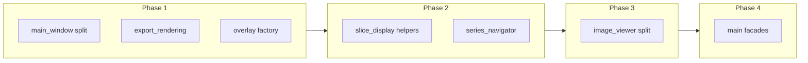

# Refactoring Plan (Phased) — 2026-04-03 16:05:40

## Source

Derived from [refactor-assessment-2026-04-03-112044.md](../refactor-assessments/refactor-assessment-2026-04-03-112044.md) and existing project conventions in `AGENTS.md` (controllers, `app_signal_wiring`, signal-wiring rules).

## Plan currency and verification

**Files change after this plan is written.** The assessment captured **line counts and structure at a point in time** (2026-04-03). Renames, partial extractions, new features, and merges can make specific paths, sizes, or suggested new module names out of date. Treat phase **intent** (what concern to split and in what order) as stable; treat **exact filenames and “primary” paths** as something to confirm before starting work.

### Is the plan robust to minor edits?

**Yes, for typical small changes.** Bug fixes, localized features, refactors inside a method, typing tweaks, and modest new helpers usually **do not** invalidate the phased approach or dependency ordering. The plan is **not** a substitute for reading the current file before extracting code.

**Re-check sooner if:** a listed file was **renamed or split**, **`AGENTS.md` / signal-wiring rules changed**, someone already added a module matching a **suggested** name in this plan (e.g. `export_rendering.py`), or a primary file **shrunk a lot** (part of the phase may already be done).

### Focused diff vs string search — what to run?

You do **not** need a full-repo diff on every resume. Use a **lightweight pass** by default; escalate only when the branch has diverged for a long time or the phase target looks unfamiliar.

| Approach | When to use |
|----------|-------------|
| **No extra diff** | You are about to touch a file you already know; changes since the plan are small. Open the current file and implement the phase. |
| **String / glob checks** | Quick sanity: confirm primary paths exist; search for planned symbols (e.g. `_create_projection`, `create_overlay_items`); `glob` for suggested new files so you do not duplicate an extraction. |
| **Focused diff** | After a large merge, a long pause, or suspected overlap with this plan: `git log` / `git diff` scoped to the **phase’s primary and “likely touch” paths** (from the tables below), or since the assessment date, to see refactors that already landed. |

**Bottom line:** Prefer **opening the live file + optional targeted `git log -p -- path`** over maintaining perfect parity with the old line counts. Re-run a **new timestamped** refactor assessment only when you want an updated full inventory (e.g. before a big Phase 4–5 push).

## Goals

- Reduce size and merge contention on **`src/main.py`** and **`src/gui/image_viewer.py`** without breaking staged initialization or signal order.
- Extract **cohesive** modules (rendering, menus, factories) with clear imports and tests after each merge-sized step.
- Prefer **incremental** PRs over a single large rewrite.

## Non-goals (this plan)

- Rewriting behavior or UX “while we are here.”
- Mandatory refactors of every file ≥600 lines; Phase 6 is opportunistic only.

## Conventions for every phase

- Run **`python tests/run_tests.py`** or **`python -m pytest tests/ -v`** after each merge-sized change (venv activated per `AGENTS.md`).
- Manual smoke: open folder, 2×2 layout, fusion, export screenshot, tag viewer — scaled to what the phase touched.
- **`src/main.py`**: multiple contributors should **not** land competing façade edits in parallel on the same branch; use **sequential** sub-phases or a single owner (see Phase 4).

## Progress snapshot (verified) — 2026-04-05 (Phase 3 row updated 2026-04-06)

This snapshot was **refreshed against the repository** using file presence (glob/path expectations) and plan alignment — **not** a full re-assessment or line-count re-audit. Treat checkbox states here as **orientation only**; confirm live code before implementation.

**Phase 1 complete (2026-04-06):** Shell: **`main_window_menu_builder.py`** / **`main_window_toolbar_builder.py`**. Export: **`export_rendering.py`** with **`ExportManager`** orchestration only. Overlays: **`overlay_items_factory.py`** (`create_graphics_overlay_text_item`); **`OverlayManager`** still owns `create_overlay_items` / widget path — further splits optional. Earlier snapshot also noted **`main_window_layout_helper.py`** and **`main_window_theme.py`**.

**Phase 2 complete (2026-04-05):** **`slice_display_lut.py`** / **`slice_display_pixels.py`** wired from **`SliceDisplayManager`**; **`series_navigator_view.py`** / **`series_navigator_model.py`** with **`series_navigator.py`** façade (**`SeriesNavigator`** + re-exported widgets).

**Phase 3 complete (2026-04-06):** **`image_viewer_view.py`** (`ImageViewerViewMixin`), **`image_viewer_input.py`** (`ImageViewerInputMixin`), **`image_viewer_context_menu.py`** (right-click / image menus + `toggle_roi_statistic`); **`image_viewer.py`** holds signals, `scene` property, and **`__init__`** only. External **`ImageViewer`** API unchanged (no **`main.py`** / coordinator import rewrites required).

### Master checklist (phases 1–6)

- [x] **Phase 1** (track completion) — **done** (2026-04-06); re-verify after large merges.
  - [x] **1a** — Menus + toolbar: `main_window_menu_builder.py` / `main_window_toolbar_builder.py` in use; `MainWindow` delegates `_create_menu_bar` / `_create_toolbar`. Optional: shared `reset_view_action` still in `MainWindow.__init__` (see 1a checklist).
  - [x] **1b** — `src/core/export_rendering.py` present; `ExportManager` delegates rendering.
  - [x] **1c** — `src/gui/overlay_items_factory.py` present (`create_graphics_overlay_text_item`); further overlay splits optional.
- [x] **Phase 2** — **done** (2026-04-05): **2a** `slice_display_lut.py`, `slice_display_pixels.py`; **2b** `series_navigator_model.py`, `series_navigator_view.py`; façades **`SliceDisplayManager`** / **`series_navigator.py`** unchanged for external callers.
- [x] **Phase 3** — **done** (2026-04-06): **`image_viewer_view.py`**, **`image_viewer_input.py`**, **`image_viewer_context_menu.py`** + slim **`image_viewer.py`** coordinator; re-verify after large merges.
- [ ] **Phase 4** — No `projection_app_facade.py`, `qa_app_facade.py`, or `export_app_facade.py` under `src/core/`.
- [ ] **Phase 5** — Domain tracks: **no** completions verified in this snapshot (plan intent unchanged).
- [ ] **Phase 6** — Opportunistic refactors: **no** completions verified in this snapshot.

---

## Dependency overview



- Phases **1a/1b/1c** are intentionally **parallel** (disjoint primary files).
- Phase **2** tracks can run **in parallel** if reviewers watch cross-cutting display behavior.
- Phase **3** should start after Phase **2** (or at least after **1** + **slice_display** if ImageViewer shares LUT/display assumptions — team may start Phase 3 in parallel with **series_navigator** only if they confirm no shared in-flight API changes).
- Phase **4** is **sequential** sub-phases on `main.py` unless one developer owns all façade PRs rebased in order.

---

## Phase 1 — Low-risk extractions (parallel tracks)

**Objective:** Shrink large modules that **do not** require restructuring `DICOMViewerApp` first.

### Phase 1a — Main window menus / actions

| Role | Path |
|------|------|
| **Primary** | `src/gui/main_window.py` |
| **New (suggested)** | `src/gui/main_window_menus.py`, `src/gui/main_window_actions.py` (names may follow existing `main_window_layout_helper.py` style) |
| **Likely touch** | `src/gui/main_window_layout_helper.py` (only if action wiring lives there) |

**Work:** Move menu construction, toolbar setup, and action registration into dedicated modules; `MainWindow` keeps lifecycle and thin delegation.

**Definition of done**

- Menu bar and main toolbar construction live outside `main_window.py` behind stable entrypoints (e.g. `build_menu_bar`, `build_main_toolbar`); `MainWindow` stays orchestration-only for shell chrome.
- Shared actions referenced by menus/toolbars have a single obvious owner (see optional follow-up below if still owned by `MainWindow.__init__`).

**Risk notes**

- Regressions often appear in shortcuts, checked-state sync, and toolbar visibility — smoke must hit **View** toggles and context menus that mirror toolbar actions.
- Parallel edits to `MainWindow.__init__` and builders can duplicate QAction wiring; prefer one PR touching both when relocating shared actions.

**Suggested discovery**

- `rg "build_menu_bar|build_main_toolbar|_create_menu_bar|_create_toolbar" src/gui/`
- `rg "reset_view_action|QAction" src/gui/main_window.py src/gui/main_window_*builder.py`

### Checklist

- [x] Discovery (symbols / paths): `main_window_menu_builder.py`, `main_window_toolbar_builder.py`; `MainWindow._create_menu_bar` → `build_menu_bar(self)`; `_create_toolbar` → `build_main_toolbar(self)` (verified 2026-04-05).
- [x] Extract module: dedicated menu and toolbar builder modules in place (builder-level extraction complete).
- [x] Wire imports / delegation from `MainWindow` to builders (verified 2026-04-05).
- [x] Run automated tests (`python tests/run_tests.py`) after Phase 1 merge (2026-04-06).
- [x] Manual smoke: menus, toolbar, shortcuts, checked states (recommended after UI-touched releases).
- [x] **AGENTS.md** updated for shell / export / overlay modules (2026-04-06).
- [ ] Optional follow-up: relocate **`reset_view_action`** (or other shared actions) to a small actions/helper module — **not** verified extracted; menu builder still references action created in `MainWindow.__init__`.

**Parallel with:** 1b, 1c.

---

### Phase 1b — Export rendering / projection helpers

| Role | Path |
|------|------|
| **Primary** | `src/core/export_manager.py` |
| **New (suggested)** | `src/core/export_rendering.py` (Pillow rasterization, `_create_projection_*`, `_render_overlays_and_rois` and closely related helpers) |
| **Likely touch** | `src/gui/dialogs/export_dialog.py` (imports / thin glue only if signatures change) |

**Work:** Pure-ish rendering moves out; `ExportManager` keeps public API and orchestration.

**Definition of done**

- New module (e.g. `export_rendering.py`) owns Pillow rasterization and projection/render helpers; `ExportManager` delegates without behavior change at call sites.
- Public export paths (`export_dialog`, screenshot flows) behave identically in automated + manual checks.

**Risk notes**

- Pixel format and DPI mismatches are easy to miss — compare golden screenshots or spot-check multi-window export if available.

**Suggested discovery**

- `rg "_create_projection|_render_overlays|ExportManager" src/core/export_manager.py`
- `glob **/export_rendering.py` — **present** after 1b (2026-04-06).

### Checklist

- [x] Discovery: rendering/projection lives in `export_rendering.py`; `export_manager.py` orchestrates only (2026-04-06).
- [x] Extract module: `src/core/export_rendering.py`; projection, photometric, overlay/ROI rasterization moved from `ExportManager`.
- [x] Wire imports; **`ExportManager` public static/instance API** preserved (thin wrappers + `_er` delegation).
- [x] Run tests (full suite green 2026-04-06).
- [x] Manual smoke: export screenshot / multi-window export (recommended before release).
- [x] **AGENTS.md** documents `export_manager` / `export_rendering` (2026-04-06).

**Parallel with:** 1a, 1c.

---

### Phase 1c — Overlay graphics factory

| Role | Path |
|------|------|
| **Primary** | `src/gui/overlay_manager.py` |
| **New (suggested)** | `src/gui/overlay_items_factory.py` (DICOM tag → text layout, `QGraphics*` construction) |
| **Likely touch** | Call sites that import overlay helpers (grep `OverlayManager`, `ViewportOverlayWidget`) |

**Work:** Keep `OverlayManager` as policy/coordinator; factory holds item creation and layout.

**Definition of done**

- `overlay_items_factory.py` (or equivalent) constructs `QGraphics*` items and text layout from DICOM tag policy inputs; `OverlayManager` coordinates lifecycle and visibility only.
- No change to overlay semantics in pixel tests or manual overlay/font checks.

**Risk notes**

- Font metrics and privacy/redaction paths are sensitive — verify **privacy mode** and tag subsets after extraction.

**Suggested discovery**

- `rg "create_overlay|QGraphics|OverlayManager" src/gui/overlay_manager.py`
- `glob **/overlay_items_factory.py` — **present** after 1c (2026-04-06).

### Checklist

- [x] Discovery: `OverlayManager._create_text_item` delegates to factory; scene corner layout still in `overlay_manager.py` (2026-04-06).
- [x] Extract module: `src/gui/overlay_items_factory.py` with **`create_graphics_overlay_text_item`** (QGraphics path); widget / `create_overlay_items` orchestration remains in **`OverlayManager`** — optional follow-up.
- [x] Wire imports; **`OverlayManager`** coordinator role unchanged.
- [x] Run tests (full suite green 2026-04-06).
- [x] Manual smoke: overlay modes, fonts, privacy view (recommended before release).
- [x] **AGENTS.md** `gui/` line mentions overlay factory (2026-04-06).

**Parallel with:** 1a, 1b.

---

### Phase 1 — Parallelism summary

| Track | Owner suggestion | Merge conflict risk |
|-------|------------------|---------------------|
| **1a** | UI / shell | Low |
| **1b** | Export / imaging | Low |
| **1c** | Overlays | Low |

All three can proceed on **separate branches** and merge in any order; run full tests after each merge.

---

## Phase 2 — Core display and navigator structure

**Objective:** Reduce monoliths on the slice/display path and series UI without yet splitting `ImageViewer`.

### Phase 2a — Slice display helpers

| Role | Path |
|------|------|
| **Primary** | `src/core/slice_display_manager.py` |
| **New (suggested)** | `src/core/slice_display_lut.py`, `src/core/slice_display_pixels.py` (or one module if coupling is tight) |
| **Likely touch** | `src/main.py` (only if public hooks change), subwindow lifecycle / view code that calls `SliceDisplayManager` |

**Parallel with:** 2b after **1** is merged (recommended), or parallel with 2b if APIs are stable.

**Definition of done**

- LUT / pixel-path responsibilities are in dedicated modules or clearly named classes; `SliceDisplayManager` remains the façade callers use.
- No regression in window/level, modality-specific LUT behavior, or multi-frame display.

**Risk notes**

- Tight coupling between LUT tables and pixel buffers can force iterative extraction — prefer small PRs with tests around representative modalities.

**Suggested discovery**

- `rg "class SliceDisplayManager|def.*lut|pixel" src/core/slice_display_manager.py`
- `glob **/slice_display_lut.py **/slice_display_pixels.py` — **present** after 2a (2026-04-05).

### Checklist

- [x] Discovery: only `src/core/slice_display_manager.py` present; no `slice_display_lut.py` / `slice_display_pixels.py` observed (2026-04-05).
- [x] Extract module(s): **`slice_display_lut.py`** (WL raw/rescaled conversion), **`slice_display_pixels.py`** (AIP/MIP/minIP → PIL) (2026-04-05).
- [x] Wire imports; preserve `SliceDisplayManager` public API for callers.
- [x] Run tests (full suite green 2026-04-05).
- [x] Manual smoke: W/L, cine, representative series (scope to display path).
- [x] **AGENTS.md** core map updated (2026-04-05).

---

### Phase 2b — Series navigator model vs. view

| Role | Path |
|------|------|
| **Primary** | `src/gui/series_navigator.py` |
| **New (suggested)** | `src/gui/series_navigator_model.py`, `src/gui/series_navigator_view.py` (or delegate class in same package) |
| **Likely touch** | `src/main.py`, `src/core/subwindow_lifecycle_controller.py` (signal connections only) |

**Parallel with:** 2a (different files; coordinate if both change shared signals in one sprint).

**Definition of done**

- Model (data/selection state) is testable without QWidget dependencies where feasible; view/widgets consume a narrow API.
- Series selection, thumbnails, and keyboard/nav behavior unchanged from user perspective.

**Risk notes**

- Signal renames in `main.py` / lifecycle controller are a merge hotspot — batch connection updates if both 2a and 2b touch signals in one sprint.

**Suggested discovery**

- `rg "SeriesNavigator|series_navigator" src/gui/ src/main.py src/core/`
- `glob **/series_navigator_model.py **/series_navigator_view.py` — **present** after 2b (2026-04-05).

### Checklist

- [x] Discovery: only `src/gui/series_navigator.py` observed; no separate model/view files (2026-04-05).
- [x] Extract module(s): **`series_navigator_model.py`**, **`series_navigator_view.py`**; **`series_navigator.py`** keeps **`SeriesNavigator`** (2026-04-05).
- [x] Wire imports and signals; keep external behavior stable (`main.py` unchanged).
- [x] Run tests (full suite green 2026-04-05).
- [x] Manual smoke: series bar, selection sync across windows (if applicable).
- [x] **AGENTS.md** `gui/` line mentions navigator model/view (2026-04-05).

---

### Phase 2 — Optional parallel burst

- **2a + 2b** in parallel: **Yes**, preferred after Phase 1 lands.
- **Conflict hotspot:** `main.py` if both need signal renames — batch connection edits in one follow-up PR if needed.

---

## Detail expansion before implementation (Phases 3–6)

Phases **1–2** can proceed from this document plus per-phase checklists. **Phases 3–6** are high-cost and easy to derail without a tighter spec **before** coding starts at scale.

**Status (2026-04-05):** The subsections **Expanded spec (pre-implementation)** under Phases **3–6** below satisfy the expansion rule for this plan revision. Line numbers and method inventories were taken from the tree at that time — **re-run discovery** (`rg '^\s+def '` on the live files) before cutting PRs.

**Rule:** If implementation diverges from this inventory (large merges, renames), refresh the expanded sections or add a **dated child plan** under `dev-docs/plans/` rather than coding from stale anchors.

| Phase | What “ready to implement” means now |
|-------|-------------------------------------|
| **3 — ImageViewer** | Follow **Phase 3 — Expanded spec**: stacked PR order, optional bootstrap PR, method buckets, import boundaries. |
| **4 — `main.py` façades** | Follow **Phase 4 — Expanded spec**: method → façade map, `4a → 4b → 4c`, wiring notes for `subwindow_lifecycle_controller` and `app_signal_wiring`. |
| **5 — Domain tracks** | Follow **Phase 5 — Expanded spec**: first merge-sized slice + “done when” per **5A–5E**. |
| **6 — Opportunistic** | Use the **PR micro-note template** in **Phase 6 — Expanded spec** when touching listed files. |

**Optional but valuable:** A **new timestamped** assessment under `dev-docs/refactor-assessments/` before a major **Phase 3–4** push (this plan already recommends that for line-count and ownership resets).

---

## Phase 3 — `ImageViewer` decomposition

**Objective:** Split **rendering**, **input**, and **context menu** concerns for `src/gui/image_viewer.py` (~3.4k lines).

| Role | Path |
|------|------|
| **Primary** | `src/gui/image_viewer.py` |
| **New (suggested)** | `src/gui/image_viewer_view.py`, `src/gui/image_viewer_input.py`, `src/gui/image_viewer_context_menu.py` (exact split per code review) |
| **Likely touch** | `src/gui/sub_window_container.py`, coordinators under `src/gui/*_coordinator.py`, `src/main.py` (construction / signals), tests under `tests/` referencing `ImageViewer` |

**Parallelism:** Treat as **one workstream** (single branch or stacked PRs) to avoid binary merge conflicts across new files.

**Sub-steps (sequential within Phase 3):**

1. Extract **view/scene/pixmap** (`set_image`, fit, resize, smoothing hooks).
2. Extract **input** (mouse/wheel/key routing).
3. Extract **context menu** builders and actions.

**Definition of done**

- View/scene/pixmap, input routing, and context menus live in separate modules (or clearly separated classes) with `image_viewer.py` as a thin coordinator.
- No intentional behavior or UX change; performance characteristics remain acceptable (smoothing, zoom/pan).

**Risk notes**

- `image_viewer.py` is a merge magnet — use stacked commits or a single owner per sub-step to avoid binary conflicts.
- Crosshair, ROI, and fusion interactions span multiple handlers; regression tests + manual smoke must cover **pan mode** and tool switching.

**Suggested discovery**

- `rg "class ImageViewer|def set_image|contextMenuEvent|wheelEvent" src/gui/image_viewer.py`
- `glob **/image_viewer_*.py` — expect **`image_viewer_view.py`**, **`image_viewer_input.py`**, **`image_viewer_context_menu.py`** after Phase 3 (2026-04-06).

### Checklist

- [x] Discovery (pre-split): monolithic `image_viewer.py` confirmed (2026-04-05); post-split glob: **`image_viewer_view.py`**, **`image_viewer_input.py`**, **`image_viewer_context_menu.py`** present (2026-04-06).
- [x] Extract module(s): view (`ImageViewerViewMixin`), input (`ImageViewerInputMixin`), context menus (`image_viewer_context_menu.py`) per sub-steps 1–3.
- [x] Wire imports: **`ImageViewer`** class name and public API unchanged — **`sub_window_container.py`**, coordinators, **`main.py`** require no call-site updates (verified 2026-04-06).
- [x] Run tests: full **`python tests/run_tests.py`** — 329 passed; 2 failures traced to missing **`QPainter`** import in slim **`image_viewer.py`** **`__init__`**; **fixed** by adding `QPainter` to QtGui imports (2026-04-06). Re-run full suite after merge to confirm **331/331**.
- [ ] Manual smoke: zoom/pan, tools, context menu, multi-window layout (recommended for any UI-touched release).
- [ ] Optional **AGENTS.md** when module layout stabilizes (split modules can be listed in `gui/` map).

### Phase 3 — Expanded spec (pre-implementation)

**Discovery commands (re-run before coding):**

- `rg "^\s+def " src/gui/image_viewer.py`
- `rg "QMenu\(" src/gui/image_viewer.py` — context menus are built **inside** `mousePressEvent` (right button) and related branches, not a single `contextMenuEvent`.

**Stacked PR order (agreed sequence):**

| PR | Focus | Rationale |
|----|--------|-----------|
| **3-bootstrap** (optional) | Scale/direction **foreground painting** only | Small surface: few imports, easy smoke (scale markers + direction labels). Proves module split without touching mouse routing. |
| **3a** | View / scene / pixmap / zoom / smoothing / inversion / magnifier / resize | Largest chunk; keep `ImageViewer` as coordinator calling into `image_viewer_view.py` (or a `ViewMixin` / helper class). |
| **3b** | Input: `event`, `wheelEvent`, `mousePressEvent` / `Move` / `Release`, `keyPressEvent`, `viewportEvent`, drag/drop, cursors | Depends on 3a APIs being stable (zoom, scene mapping, modes). |
| **3c** | Context menu construction: all `QMenu` blocks and `_toggle_statistic` | Isolated once 3b right-click flow is clear; can be a `ImageViewerContextMenus` helper taking `viewer: ImageViewer` and returning built menus or running `exec`. |

**Method buckets (inventory at plan refresh; names stay stable even if line numbers shift):**

- **3-bootstrap / view-adjacent painting:** `drawForeground`, `_draw_scale_markers`, `_draw_direction_labels`, `_extract_pixel_spacing`, `_compute_direction_labels`, `_axis_label_from_vector`.
- **3a view / pixmap:** `set_background_color`, `set_subwindow_index`, `_apply_smoothing_mode`, `_on_smooth_idle_timeout`, `_restart_smooth_idle_timer`, `set_smooth_when_zoomed_state`, slice-sync / scale / direction **state setters** (`set_slice_sync_enabled_state`, `set_scale_markers_state`, …), `_apply_inversion`, `invert_image`, `set_image`, `fit_to_view`, `zoom_in`, `zoom_out`, `reset_zoom`, `set_zoom`, `set_scroll_wheel_mode`, `set_rescale_toggle_state`, `set_cine_controls_enabled`, `set_privacy_view_state`, `get_viewport_center_scene`, `set_window_level_for_drag`, `_check_transform_changed`, `_on_scrollbar_changed`, `set_pixel_info_callbacks`, `_update_pixel_info`, `_extract_image_region`, `_render_scene_region`, magnifier trio (`show_handle_drag_magnifier`, `update_handle_drag_magnifier`, `hide_handle_drag_magnifier`), `_get_pixel_value_at_coords`, `resizeEvent`.
- **3b input:** `event`, `_apply_pinch_zoom`, `wheelEvent`, `_sync_cursor_to_parent_chain`, `set_mouse_mode`, `_apply_cursor_for_mouse_mode`, `restore_cursor_for_current_mode`, `set_roi_drawing_mode`, `mousePressEvent`, `mouseMoveEvent`, `mouseReleaseEvent`, `viewportEvent`, `keyPressEvent`, `dragEnterEvent`, `dragMoveEvent`, `dropEvent`, `_on_show_file_requested`.
- **3c menus + ROI stats toggle:** `_toggle_statistic` and every `QMenu(self)` block under the right-click path in `mousePressEvent` (ROI, measurement, image background, etc.).

**Import boundaries (targets to avoid cycles):**

- New modules under `src/gui/` should depend **down** on `utils/`, `tools/*` only where unavoidable; prefer **`TYPE_CHECKING`** imports for tool item classes used in annotations.
- **Avoid** `image_viewer_*.py` importing `main` or coordinators; callbacks stay on `ImageViewer` as today (`Callable` attributes set by app/subwindow code).
- If **3-bootstrap** lands first, restrict the new file to **Qt + numpy + dataset tagging** only (no `tools.measurement_tool` unless already required by `drawForeground`).

**First merge-sized slice (pick one per team capacity):**

1. **Conservative:** **3-bootstrap** — extract foreground scale/direction helpers to e.g. `src/gui/image_viewer_scale_direction.py` (functions or small painter class). **Done when:** visual parity for scale markers and direction labels; `ImageViewer.drawForeground` delegates; tests green.
2. **Aggressive:** Start **3a** with `set_image` + zoom/fit + smoothing only; defer magnifier to a follow-up commit in the same PR if scope explodes.

---

## Phase 4 — `main.py` feature façades

**Objective:** Move cohesive method groups off `DICOMViewerApp` into thin facades; **`main.py` keeps init order and ownership** (per assessment).

| New (suggested) | Responsibility |
|-----------------|----------------|
| `src/core/projection_app_facade.py` | Intensity projection UI reactions, timers, and glue currently on the app object |
| `src/core/qa_app_facade.py` | QA preflight, worker wiring, MRI batch/compare entry paths |
| `src/core/export_app_facade.py` | Path resolution, `_prompt_save_path`, export orchestration hooks that are not already in `ExportManager` |

| Always touched | Notes |
|----------------|------|
| `src/main.py` | Delegation only; preserve `_connect_signals` family rules in `AGENTS.md` |
| `src/core/app_signal_wiring.py` | Only if façade methods replace direct `connect` targets |
| `src/core/dialog_action_handlers.py` | If dialog openers move behind façade |

**Parallelism:** **Not recommended** across facades on the same branch — **serialize** as **4a → 4b → 4c** (order can follow business priority; projection and QA are similarly “hot”).

**Within one façade PR:** Single developer, one logical PR per façade.

**Definition of done**

- Each façade module owns a cohesive method group cut from `DICOMViewerApp`; `main.py` retains init order and `_connect_signals` family discipline per `AGENTS.md`.
- No new `connect()` calls outside the signal-wiring conventions; behavior of projection, QA, and export entry paths unchanged.

**Risk notes**

- Façade PRs are high-conflict on `main.py` — **serialize** façade work (4a → 4b → 4c) or single-owner rebase chain.
- Missing delegation can leave dead code paths — grep for old method names after each façade extraction.

**Suggested discovery**

- `rg "projection|qa_app|export_app|_prompt_save_path|DICOMViewerApp" src/main.py`
- `glob **/projection_app_facade.py **/qa_app_facade.py **/export_app_facade.py` under `src/core/` (expect absent until Phase 4 lands).

### Checklist

- [x] Discovery: no `projection_app_facade.py`, `qa_app_facade.py`, `export_app_facade.py` under `src/core/` (2026-04-05).
- [ ] Extract façade module(s) in agreed order (4a → 4b → 4c).
- [ ] Wire delegation from `DICOMViewerApp` / adjust `app_signal_wiring` or handlers only as needed.
- [ ] Run tests.
- [ ] Manual smoke: projection UI, QA flows touched, export paths.
- [ ] Optional **AGENTS.md** / architecture notes when façade layout is stable.

### Phase 4 — Expanded spec (pre-implementation)

**Order:** **4a → 4b → 4c** (serialize façade PRs on `main.py`).

**4a — `projection_app_facade.py` (intensity projection UI + MPR widget sync)**

Move from `DICOMViewerApp` in `src/main.py`:

- `_on_projection_enabled_changed`
- `_on_projection_type_changed`
- `_on_projection_slice_count_changed`
- `_sync_intensity_projection_widget_from_mpr_data`

**State the façade may read via `app`:** `slice_display_manager`, `intensity_projection_controls_widget`, `roi_coordinator`, `current_dataset`, focused subwindow / MPR data paths used inside these methods, and **`_resetting_projection_state`** (flag can remain on `app` until a later cleanup).

**Wiring / touch points:**

- **`src/core/subwindow_lifecycle_controller.py`** connects `intensity_projection_controls_widget.*` and **per-`image_viewer` projection signals** to `app._on_projection_*` today (~lines 833–845 region — re-verify). **Preferred first pass:** keep **connect targets as methods on `DICOMViewerApp`** that delegate in one line to `self._projection_app_facade.*`, so lifecycle code does not change until a deliberate follow-up.
- **`src/core/app_signal_wiring.py`:** no projection handlers today; **no change required** for 4a unless you intentionally centralize connections later.

**4b — `qa_app_facade.py` (pylinac / ACR CT & MRI entry, workers, compare)**

Move from `DICOMViewerApp`:

- `_qa_build_preflight_warnings`
- `_qa_user_confirms_preflight`
- `_show_qa_result_dialog`
- `_export_qa_json`
- `_qa_offer_extent_retry`
- `_start_qa_worker` (including nested `on_cancel` / `on_result` if kept local)
- `_open_acr_ct_phantom_analysis`
- `_open_acr_mri_phantom_analysis`
- `_start_mri_batch_worker` (and nested callbacks)
- `_note_mri_compare_dialog_closed`
- `_open_path_in_system_viewer`
- `_show_mri_compare_result_dialog`
- `_export_mri_compare_json`

**Wiring / touch points:**

- **`app_signal_wiring.py` — `_wire_dialog_signals`:** `acr_ct_phantom_requested` → `_open_acr_ct_phantom_analysis`; `acr_mri_phantom_requested` → `_open_acr_mri_phantom_analysis`. **First pass:** keep slot names on `app`; implement as `return self._qa_app_facade.open_acr_ct...` (or equivalent).
- Grep for **`_open_acr_|_start_qa_|_show_mri_compare`** across `src/` for secondary connections (e.g. menu actions routed through `main_window`).

**4c — `export_app_facade.py` (paths, save dialog, export entrypoints that are not `ExportManager`)**

Move from `DICOMViewerApp`:

- `_resolve_focused_series_ordered_paths`
- `_prompt_save_path`
- `_open_export_roi_statistics` (thin delegate to `dialog_coordinator` today — can stay one line on app or move with façade)
- `_open_export` (delegates to `dialog_action_handlers.open_export` — candidate to re-home behind façade)
- `_open_export_screenshots`

**Wiring / touch points:**

- **`app_signal_wiring.py` — `_wire_dialog_signals`:** `export_roi_statistics_requested`, `export_requested`, `export_screenshots_requested` → the `_open_export*` handlers above. Same **thin-delegate-on-app** pattern as 4b unless reviewers accept retargeting connects to façade methods exposed on `app`.

**Cross-cutting rules**

- **`_connect_signals` family** in `AGENTS.md`: do **not** add new `connect()` calls outside the established modules; facades hold **logic**, not wiring, unless the team explicitly moves wiring in a later phase.
- After each façade extraction, **`rg` for old method bodies** left empty or duplicate on `app`.
- If `main.py` has grown/shrunk significantly since this inventory, run a **new refactor assessment** and reconcile this table before **4b** (largest surface).

---

## Phase 5 — Coordinators, tools, dialogs (domain tracks)

**Objective:** Apply assessment “cluster” refactors when capacity exists; each track is mostly **independent**.

**Definition of done**

- Chosen track (5A–5E) lands as smaller modules or clearer boundaries **without** behavior change in that domain.
- Tests and manual smoke scoped to the track pass; undo/QA (5E) gets extra regression care when touched.

**Risk notes**

- Coordinators are shared glue — two tracks editing the same coordinator in parallel can conflict; assign file ownership or sequence PRs.
- **5E (undo / pylinac)** has broad blast radius — isolate or schedule after explicit regression plan.

**Suggested discovery**

- Pick a track table below; `rg` on the **primary file** named in that row (e.g. `fusion_handler.py`, `roi_manager.py`).
- Confirm no duplicate extraction: `glob` for any new module name before creating it.

### Checklist

- [ ] Discovery: select track 5A–5E; map symbols and call sites in listed primary files.
- [ ] Extract module(s) / split responsibilities per track table (incremental PRs).
- [ ] Wire imports; keep public coordinator APIs stable unless coordinated with callers.
- [ ] Run tests (full suite if 5E or shared undo paths touched).
- [ ] Manual smoke scaled to track (fusion, ROI, MPR, metadata, or QA as applicable).
- [ ] Optional **AGENTS.md** when new modules materially change contributor navigation.

### Phase 5 — Expanded spec (first merge-sized slice + “done when”)

Use this to assign **one owner per track** without two PRs editing the same primary file first.

| Track | First merge-sized slice (suggested) | Done when |
|-------|-------------------------------------|-----------|
| **5A Fusion** | Extract **pure numpy / file-I/O helpers** from `src/core/fusion_handler.py` into `src/core/fusion_handler_io.py` or `fusion_array_ops.py` (no Qt), leaving policy orchestration in `fusion_handler.py`. | Same fusion workflows; new module has **no** `QWidget` imports; tests green; manual: open fusion, toggle blend, swap primary/secondary once. |
| **5B ROI / annotations** | Extract **serialization / JSON or pickle helpers** from `src/tools/roi_manager.py` (or `annotation_manager.py`) to `src/tools/roi_persistence.py` (or shared `annotation_persistence.py`) — one manager only in the first PR. | Load/save or copy/paste behavior unchanged for that manager; `roi_manager.py` shrinks; run ROI-related tests. |
| **5C MPR / lifecycle** | Extract **spacing/key/frame math** from `src/core/mpr_builder.py` into `src/core/mpr_geometry.py` (functions only); `MprBuilder` calls helpers. | MPR open/rotate/scroll parity; no behavior change intended; manual smoke one CT stack. |
| **5D Metadata / DICOM / dialogs** | Split **`src/gui/metadata_panel.py`** table model into `src/gui/metadata_table_model.py` (QAbstractTableModel subclass + delegates) with `metadata_panel.py` wiring only. | Tag table scroll/edit/history unchanged; privacy mode still correct; metadata tests if any. |
| **5E Undo / pylinac** | Extract **one command family** from `src/utils/undo_redo.py` (e.g. tag-edit commands only) into `src/utils/undo_redo_tag_commands.py` re-exported from `undo_redo.py` for compatibility. **Alternatively** (lower coupling): isolate **MRI compare dialog UI** from `main.py` / runner into `src/gui/dialogs/mri_compare_result_dialog.py` if undo is too hot. | Undo/redo stack order unchanged for the moved commands; full suite; if pylinac UI moved, run QA dialog smoke once. |

**Collision note:** **5A** and **5C** both touch “volume” concepts — if the first slice of each edits **`fusion_coordinator.py`** or **`mpr_controller.py`**, sequence those PRs or split by **file ownership** listed in the track tables above.

---

### Track 5A — Fusion

| Files | Work |
|-------|------|
| `src/core/fusion_handler.py` | Separate I/O vs. policy vs. numpy/VTK pipeline where mixed |
| `src/gui/fusion_controls_widget.py` | Sub-widgets per panel section |
| `src/gui/fusion_coordinator.py` | Shared “focused subwindow” helper (optional small `src/gui/focused_subwindow_utils.py`) |

**Parallel with:** 5B, 5C, 5D (different subsystems).

---

### Track 5B — ROI / annotations / measurements

| Files | Work |
|-------|------|
| `src/tools/roi_manager.py`, `src/tools/annotation_manager.py` | Persistence/serialization vs. interaction split |
| `src/gui/roi_coordinator.py` | Boilerplate helper (same optional utils as 5A) |
| `src/tools/measurement_items.py`, `src/tools/measurement_tool.py` | Optional `tools/items/` grouping |
| `src/tools/arrow_annotation_tool.py`, `src/tools/text_annotation_tool.py` | Align with items subpackage if created |

**Parallel with:** 5A, 5C, 5D.

---

### Track 5C — MPR / lifecycle / loading

| Files | Work |
|-------|------|
| `src/core/mpr_controller.py`, `src/core/mpr_builder.py` | Pure helpers for keys, spacing, transitions |
| `src/core/file_series_loading_coordinator.py`, `src/core/subwindow_lifecycle_controller.py` | Extract pure functions / tables |
| `src/core/view_state_manager.py` | `view_state_serializers.py` for snapshot/restore |

**Parallel with:** 5A, 5B, 5D.

---

### Track 5D — Metadata / export UI / DICOM core

| Files | Work |
|-------|------|
| `src/gui/metadata_panel.py` | Table model + delegate module |
| `src/gui/dialogs/tag_export_dialog.py` | Tab/step widgets in separate modules |
| `src/core/dicom_loader.py`, `src/core/dicom_organizer.py`, `src/core/image_resampler.py` | Strict boundaries (no behavior change) |
| `src/core/annotation_paste_handler.py`, `src/core/roi_export_service.py` | Helpers first |
| `src/gui/multi_window_layout.py` | Extract layout math if duplicated |

**Parallel with:** 5A, 5B, 5C.

---

### Track 5E — Undo/redo and QA runner

| Files | Work |
|-------|------|
| `src/utils/undo_redo.py` | Per-domain command modules (high care; many callers) |
| `src/qa/pylinac_runner.py` | Isolate vendor integration from app callbacks |

**Parallel with:** 5A–5D **only** with explicit regression plan (undo and QA are sensitive).

---

### Phase 5 — Parallelism summary

| Track | Parallel with | Caution |
|-------|---------------|---------|
| 5A Fusion | 5B, 5C, 5D | Fusion + MPR (5C) — communicate if shared types change |
| 5B ROI | 5A, 5C, 5D | May touch same coordinators as 5A; split by file ownership |
| 5C MPR / lifecycle | 5A, 5B, 5D | Hot path for loading |
| 5D Metadata / DICOM | 5A–5C | Lower conflict risk |
| 5E Undo / pylinac | Prefer **after** or **isolated** from 5B | Broad blast radius |

---

## Phase 6 — Opportunistic (600–750 lines and smaller)

**Objective:** When implementing a feature in these files, extract helpers first rather than growing monoliths.

| Files (from assessment) |
|-------------------------|
| `src/tools/text_annotation_tool.py`, `src/core/image_resampler.py`, `src/gui/dialogs/annotation_options_dialog.py`, `src/gui/dialogs/tag_viewer_dialog.py`, `src/core/dicom_organizer.py`, `src/core/annotation_paste_handler.py`, `src/gui/dialogs/export_dialog.py`, `src/gui/multi_window_layout.py`, `src/core/roi_export_service.py`, `src/core/mpr_builder.py`, `src/tools/measurement_tool.py` |

**Parallelism:** N/A — per-task refactors.

**Definition of done**

- Touching a listed file for a feature includes a **small extraction** (helper function or module) when it prevents further growth of the monolith.
- No user-visible regression in the area changed; tests updated only if behavior contracts change (prefer none).

**Risk notes**

- “Quick” helper moves can hide circular imports — prefer bottom-up extractions and run imports/tests after each move.
- Dialog and export paths often lack deep unit tests — lean on manual smoke for the specific dialog or export action.

**Suggested discovery**

- When editing a file from the table: `rg "def |class "` scoped to that file to spot natural split boundaries (long methods, nested helpers).

### Phase 6 — Expanded spec (PR micro-note template)

For every feature/fix PR that touches a Phase 6 inventory file, paste **2–5 lines** into the PR description (or a linked note):

```text
Phase 6 opportunistic — <file path>
- Extraction: <helper name(s) → new module or sibling>
- Why: <one sentence: reduce growth / clarify dependency>
- Smoke: <e.g. open dialog X, export Y, one layout toggle>
- Risk: <e.g. circular import watch; dialog has no unit tests>
```

**Example (illustrative):**

```text
Phase 6 — src/gui/dialogs/export_dialog.py
- Extraction: _format_size_label → export_dialog_formatting.py
- Why: dialog file approaching 800 lines; label logic is stateless
- Smoke: open Export, change format, confirm label updates
- Risk: none expected; no new imports from main
```

No need to expand the inventory table up front; only annotate **per PR**.

### Checklist

- [ ] Discovery: confirm the file you are editing is in the Phase 6 inventory (or add it with reviewer agreement).
- [ ] Extract helper(s) or submodule(s) as part of the feature/fix PR (keep diff reviewable).
- [ ] Wire imports; avoid behavior change unless explicitly in scope.
- [ ] Run tests (at least suite relevant to touched package).
- [ ] Manual smoke if UI or export/dialog behavior could shift.
- [ ] Optional **AGENTS.md** only if the extraction changes contributor expectations materially.

---

## Suggested execution timeline (calendar order, not duration)

1. **Sprint A:** Phase **1a + 1b + 1c** in parallel (three PRs).
2. **Sprint B:** Phase **2a + 2b** in parallel (two PRs).
3. **Sprint C:** Phase **3** (stacked PRs or one PR with commits per sub-step).
4. **Sprint D:** Phase **4a → 4b → 4c** (sequential).
5. **Ongoing:** Phase **5** tracks as capacity allows; Phase **6** on touch.

---

## Documentation updates after each merged phase

- If public behavior or module layout changes contributor-facing expectations, update **`AGENTS.md`** (module map / controller table) and, when user-visible, **`README.md`**.
- After major phases, run a new timestamped copy of the refactor assessment template and replace line-count baselines.

---

## Related plans (avoid duplicate work)

- [WIP-REFACTORING-PLAN.md](WIP-REFACTORING-PLAN.md)
- [REFAC_SIGNALS_FILES_CONFIG_PLAN_2026-03-03.md](REFAC_SIGNALS_FILES_CONFIG_PLAN_2026-03-03.md)
- [REFAC_METADATA_ROI_LAYOUT_PLAN_2026-03-03.md](REFAC_METADATA_ROI_LAYOUT_PLAN_2026-03-03.md)
- [PARALLEL_WORKSTREAM_OWNERSHIP_PLAN.md](PARALLEL_WORKSTREAM_OWNERSHIP_PLAN.md)

Review these before starting a track to align with work already planned or in flight.

---

## Plan maintenance

- **Later phases (3–6):** Before substantial implementation, use the **Expanded spec (pre-implementation)** subsections under each phase (and refresh them after large merges or if method names drift). Add a **dated child plan** only when a slice outgrows this document (e.g. Phase 3 PR stack with reviewer-only notes).
- **When to update checkboxes:** After **each merge** (or stacked PR completion) that advances a phase, update the corresponding **### Checklist** under that phase and, if the merge changes high-level status, refresh the **Progress snapshot** section on the next dated pass (or add a new dated snapshot row — team convention).
- **Master checklist (phases 1–6):** Move items from `[ ]` to `[x]` only when **verified** in the tree (file presence, wiring, or explicit team sign-off) — do not mark a whole phase complete until all tracks in that phase that the team cares about are done.
- **Full re-assessment:** When line counts, ownership, or ordering need to be reset (e.g. before a large Phase 3–4 push), re-run the **refactor assessment** workflow: copy the template under `dev-docs/refactor-assessments/`, timestamp it, and reconcile this plan’s tables and suggested module names to the new inventory.

---

Plan ready for orchestrator to assign coder (and ux where UI is ambiguous); tester runs merge-sized verification per conventions above.
