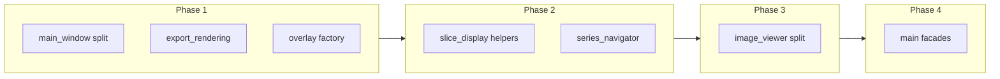

# Refactoring Plan (Phased) — 2026-04-03 16:05:40

## Source

Derived from [refactor-assessment-2026-04-03-112044.md](../refactor-assessments/refactor-assessment-2026-04-03-112044.md) and existing project conventions in `AGENTS.md` (controllers, `app_signal_wiring`, signal-wiring rules).

## Plan currency and verification

**Files change after this plan is written.** The assessment captured **line counts and structure at a point in time** (2026-04-03). Renames, partial extractions, new features, and merges can make specific paths, sizes, or suggested new module names out of date. Treat phase **intent** (what concern to split and in what order) as stable; treat **exact filenames and “primary” paths** as something to confirm before starting work.

### Is the plan robust to minor edits?

**Yes, for typical small changes.** Bug fixes, localized features, refactors inside a method, typing tweaks, and modest new helpers usually **do not** invalidate the phased approach or dependency ordering. The plan is **not** a substitute for reading the current file before extracting code.

**Re-check sooner if:** a listed file was **renamed or split**, **`AGENTS.md` / signal-wiring rules changed**, someone already added a module matching a **suggested** name in this plan (e.g. `export_rendering.py`), or a primary file **shrunk a lot** (part of the phase may already be done).

### Focused diff vs string search — what to run?

You do **not** need a full-repo diff on every resume. Use a **lightweight pass** by default; escalate only when the branch has diverged for a long time or the phase target looks unfamiliar.

| Approach | When to use |
|----------|-------------|
| **No extra diff** | You are about to touch a file you already know; changes since the plan are small. Open the current file and implement the phase. |
| **String / glob checks** | Quick sanity: confirm primary paths exist; search for planned symbols (e.g. `_create_projection`, `create_overlay_items`); `glob` for suggested new files so you do not duplicate an extraction. |
| **Focused diff** | After a large merge, a long pause, or suspected overlap with this plan: `git log` / `git diff` scoped to the **phase’s primary and “likely touch” paths** (from the tables below), or since the assessment date, to see refactors that already landed. |

**Bottom line:** Prefer **opening the live file + optional targeted `git log -p -- path`** over maintaining perfect parity with the old line counts. Re-run a **new timestamped** refactor assessment only when you want an updated full inventory (e.g. before a big Phase 4–5 push).

## Goals

- Reduce size and merge contention on **`src/main.py`** and **`src/gui/image_viewer.py`** without breaking staged initialization or signal order.
- Extract **cohesive** modules (rendering, menus, factories) with clear imports and tests after each merge-sized step.
- Prefer **incremental** PRs over a single large rewrite.

## Non-goals (this plan)

- Rewriting behavior or UX “while we are here.”
- Mandatory refactors of every file ≥600 lines; Phase 6 is opportunistic only.

## Conventions for every phase

- Run **`python tests/run_tests.py`** or **`python -m pytest tests/ -v`** after each merge-sized change (venv activated per `AGENTS.md`).
- Manual smoke: open folder, 2×2 layout, fusion, export screenshot, tag viewer — scaled to what the phase touched.
- **`src/main.py`**: multiple contributors should **not** land competing façade edits in parallel on the same branch; use **sequential** sub-phases or a single owner (see Phase 4).

---

## Dependency overview

- Phases **1a/1b/1c** are intentionally **parallel** (disjoint primary files).
- Phase **2** tracks can run **in parallel** if reviewers watch cross-cutting display behavior.
- Phase **3** should start after Phase **2** (or at least after **1** + **slice_display** if ImageViewer shares LUT/display assumptions — team may start Phase 3 in parallel with **series_navigator** only if they confirm no shared in-flight API changes).
- Phase **4** is **sequential** sub-phases on `main.py` unless one developer owns all façade PRs rebased in order.

---

## Phase 1 — Low-risk extractions (parallel tracks)

**Objective:** Shrink large modules that **do not** require restructuring `DICOMViewerApp` first.

### Phase 1a — Main window menus / actions

| Role | Path |
|------|------|
| **Primary** | `src/gui/main_window.py` |
| **New (suggested)** | `src/gui/main_window_menus.py`, `src/gui/main_window_actions.py` (names may follow existing `main_window_layout_helper.py` style) |
| **Likely touch** | `src/gui/main_window_layout_helper.py` (only if action wiring lives there) |

**Work:** Move menu construction, toolbar setup, and action registration into dedicated modules; `MainWindow` keeps lifecycle and thin delegation.

**Parallel with:** 1b, 1c.

---

### Phase 1b — Export rendering / projection helpers

| Role | Path |
|------|------|
| **Primary** | `src/core/export_manager.py` |
| **New (suggested)** | `src/core/export_rendering.py` (Pillow rasterization, `_create_projection_*`, `_render_overlays_and_rois` and closely related helpers) |
| **Likely touch** | `src/gui/dialogs/export_dialog.py` (imports / thin glue only if signatures change) |

**Work:** Pure-ish rendering moves out; `ExportManager` keeps public API and orchestration.

**Parallel with:** 1a, 1c.

---

### Phase 1c — Overlay graphics factory

| Role | Path |
|------|------|
| **Primary** | `src/gui/overlay_manager.py` |
| **New (suggested)** | `src/gui/overlay_items_factory.py` (DICOM tag → text layout, `QGraphics*` construction) |
| **Likely touch** | Call sites that import overlay helpers (grep `OverlayManager`, `ViewportOverlayWidget`) |

**Work:** Keep `OverlayManager` as policy/coordinator; factory holds item creation and layout.

**Parallel with:** 1a, 1b.

---

### Phase 1 — Parallelism summary

| Track | Owner suggestion | Merge conflict risk |
|-------|------------------|---------------------|
| **1a** | UI / shell | Low |
| **1b** | Export / imaging | Low |
| **1c** | Overlays | Low |

All three can proceed on **separate branches** and merge in any order; run full tests after each merge.

---

## Phase 2 — Core display and navigator structure

**Objective:** Reduce monoliths on the slice/display path and series UI without yet splitting `ImageViewer`.

### Phase 2a — Slice display helpers

| Role | Path |
|------|------|
| **Primary** | `src/core/slice_display_manager.py` |
| **New (suggested)** | `src/core/slice_display_lut.py`, `src/core/slice_display_pixels.py` (or one module if coupling is tight) |
| **Likely touch** | `src/main.py` (only if public hooks change), subwindow lifecycle / view code that calls `SliceDisplayManager` |

**Parallel with:** 2b after **1** is merged (recommended), or parallel with 2b if APIs are stable.

---

### Phase 2b — Series navigator model vs. view

| Role | Path |
|------|------|
| **Primary** | `src/gui/series_navigator.py` |
| **New (suggested)** | `src/gui/series_navigator_model.py`, `src/gui/series_navigator_view.py` (or delegate class in same package) |
| **Likely touch** | `src/main.py`, `src/core/subwindow_lifecycle_controller.py` (signal connections only) |

**Parallel with:** 2a (different files; coordinate if both change shared signals in one sprint).

---

### Phase 2 — Optional parallel burst

- **2a + 2b** in parallel: **Yes**, preferred after Phase 1 lands.
- **Conflict hotspot:** `main.py` if both need signal renames — batch connection edits in one follow-up PR if needed.

---

## Phase 3 — `ImageViewer` decomposition

**Objective:** Split **rendering**, **input**, and **context menu** concerns for `src/gui/image_viewer.py` (~3.4k lines).

| Role | Path |
|------|------|
| **Primary** | `src/gui/image_viewer.py` |
| **New (suggested)** | `src/gui/image_viewer_view.py`, `src/gui/image_viewer_input.py`, `src/gui/image_viewer_context_menu.py` (exact split per code review) |
| **Likely touch** | `src/gui/sub_window_container.py`, coordinators under `src/gui/*_coordinator.py`, `src/main.py` (construction / signals), tests under `tests/` referencing `ImageViewer` |

**Parallelism:** Treat as **one workstream** (single branch or stacked PRs) to avoid binary merge conflicts across new files.

**Sub-steps (sequential within Phase 3):**

1. Extract **view/scene/pixmap** (`set_image`, fit, resize, smoothing hooks).
2. Extract **input** (mouse/wheel/key routing).
3. Extract **context menu** builders and actions.

---

## Phase 4 — `main.py` feature façades

**Objective:** Move cohesive method groups off `DICOMViewerApp` into thin facades; **`main.py` keeps init order and ownership** (per assessment).

| New (suggested) | Responsibility |
|-----------------|----------------|
| `src/core/projection_app_facade.py` | Intensity projection UI reactions, timers, and glue currently on the app object |
| `src/core/qa_app_facade.py` | QA preflight, worker wiring, MRI batch/compare entry paths |
| `src/core/export_app_facade.py` | Path resolution, `_prompt_save_path`, export orchestration hooks that are not already in `ExportManager` |

| Always touched | Notes |
|----------------|------|
| `src/main.py` | Delegation only; preserve `_connect_signals` family rules in `AGENTS.md` |
| `src/core/app_signal_wiring.py` | Only if façade methods replace direct `connect` targets |
| `src/core/dialog_action_handlers.py` | If dialog openers move behind façade |

**Parallelism:** **Not recommended** across facades on the same branch — **serialize** as **4a → 4b → 4c** (order can follow business priority; projection and QA are similarly “hot”).

**Within one façade PR:** Single developer, one logical PR per façade.

---

## Phase 5 — Coordinators, tools, dialogs (domain tracks)

**Objective:** Apply assessment “cluster” refactors when capacity exists; each track is mostly **independent**.

### Track 5A — Fusion

| Files | Work |
|-------|------|
| `src/core/fusion_handler.py` | Separate I/O vs. policy vs. numpy/VTK pipeline where mixed |
| `src/gui/fusion_controls_widget.py` | Sub-widgets per panel section |
| `src/gui/fusion_coordinator.py` | Shared “focused subwindow” helper (optional small `src/gui/focused_subwindow_utils.py`) |

**Parallel with:** 5B, 5C, 5D (different subsystems).

---

### Track 5B — ROI / annotations / measurements

| Files | Work |
|-------|------|
| `src/tools/roi_manager.py`, `src/tools/annotation_manager.py` | Persistence/serialization vs. interaction split |
| `src/gui/roi_coordinator.py` | Boilerplate helper (same optional utils as 5A) |
| `src/tools/measurement_items.py`, `src/tools/measurement_tool.py` | Optional `tools/items/` grouping |
| `src/tools/arrow_annotation_tool.py`, `src/tools/text_annotation_tool.py` | Align with items subpackage if created |

**Parallel with:** 5A, 5C, 5D.

---

### Track 5C — MPR / lifecycle / loading

| Files | Work |
|-------|------|
| `src/core/mpr_controller.py`, `src/core/mpr_builder.py` | Pure helpers for keys, spacing, transitions |
| `src/core/file_series_loading_coordinator.py`, `src/core/subwindow_lifecycle_controller.py` | Extract pure functions / tables |
| `src/core/view_state_manager.py` | `view_state_serializers.py` for snapshot/restore |

**Parallel with:** 5A, 5B, 5D.

---

### Track 5D — Metadata / export UI / DICOM core

| Files | Work |
|-------|------|
| `src/gui/metadata_panel.py` | Table model + delegate module |
| `src/gui/dialogs/tag_export_dialog.py` | Tab/step widgets in separate modules |
| `src/core/dicom_loader.py`, `src/core/dicom_organizer.py`, `src/core/image_resampler.py` | Strict boundaries (no behavior change) |
| `src/core/annotation_paste_handler.py`, `src/core/roi_export_service.py` | Helpers first |
| `src/gui/multi_window_layout.py` | Extract layout math if duplicated |

**Parallel with:** 5A, 5B, 5C.

---

### Track 5E — Undo/redo and QA runner

| Files | Work |
|-------|------|
| `src/utils/undo_redo.py` | Per-domain command modules (high care; many callers) |
| `src/qa/pylinac_runner.py` | Isolate vendor integration from app callbacks |

**Parallel with:** 5A–5D **only** with explicit regression plan (undo and QA are sensitive).

---

### Phase 5 — Parallelism summary

| Track | Parallel with | Caution |
|-------|---------------|---------|
| 5A Fusion | 5B, 5C, 5D | Fusion + MPR (5C) — communicate if shared types change |
| 5B ROI | 5A, 5C, 5D | May touch same coordinators as 5A; split by file ownership |
| 5C MPR / lifecycle | 5A, 5B, 5D | Hot path for loading |
| 5D Metadata / DICOM | 5A–5C | Lower conflict risk |
| 5E Undo / pylinac | Prefer **after** or **isolated** from 5B | Broad blast radius |

---

## Phase 6 — Opportunistic (600–750 lines and smaller)

**Objective:** When implementing a feature in these files, extract helpers first rather than growing monoliths.

| Files (from assessment) |
|-------------------------|
| `src/tools/text_annotation_tool.py`, `src/core/image_resampler.py`, `src/gui/dialogs/annotation_options_dialog.py`, `src/gui/dialogs/tag_viewer_dialog.py`, `src/core/dicom_organizer.py`, `src/core/annotation_paste_handler.py`, `src/gui/dialogs/export_dialog.py`, `src/gui/multi_window_layout.py`, `src/core/roi_export_service.py`, `src/core/mpr_builder.py`, `src/tools/measurement_tool.py` |

**Parallelism:** N/A — per-task refactors.

---

## Suggested execution timeline (calendar order, not duration)

1. **Sprint A:** Phase **1a + 1b + 1c** in parallel (three PRs).
2. **Sprint B:** Phase **2a + 2b** in parallel (two PRs).
3. **Sprint C:** Phase **3** (stacked PRs or one PR with commits per sub-step).
4. **Sprint D:** Phase **4a → 4b → 4c** (sequential).
5. **Ongoing:** Phase **5** tracks as capacity allows; Phase **6** on touch.

---

## Documentation updates after each merged phase

- If public behavior or module layout changes contributor-facing expectations, update **`AGENTS.md`** (module map / controller table) and, when user-visible, **`README.md`**.
- After major phases, run a new timestamped copy of the refactor assessment template and replace line-count baselines.

---

## Related plans (avoid duplicate work)

- [WIP-REFACTORING-PLAN.md](WIP-REFACTORING-PLAN.md)
- [REFAC_SIGNALS_FILES_CONFIG_PLAN_2026-03-03.md](REFAC_SIGNALS_FILES_CONFIG_PLAN_2026-03-03.md)
- [REFAC_METADATA_ROI_LAYOUT_PLAN_2026-03-03.md](REFAC_METADATA_ROI_LAYOUT_PLAN_2026-03-03.md)
- [PARALLEL_WORKSTREAM_OWNERSHIP_PLAN.md](PARALLEL_WORKSTREAM_OWNERSHIP_PLAN.md)

Review these before starting a track to align with work already planned or in flight.
