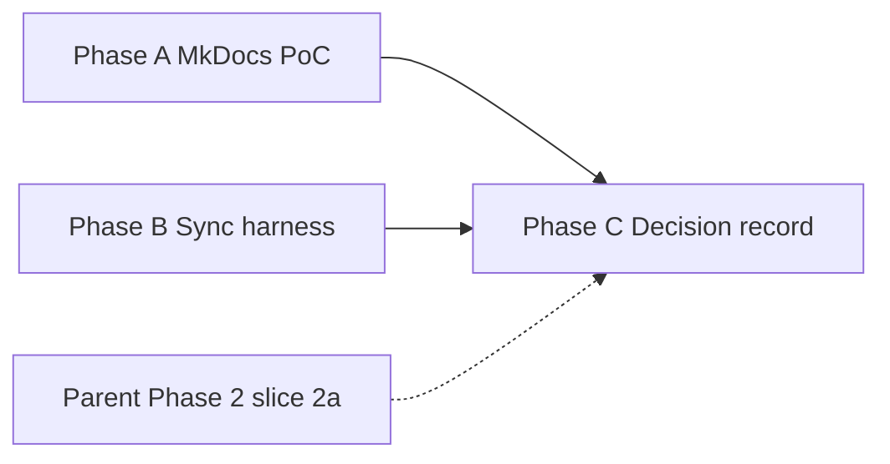

# User docs platform pilot and sync harness plan

**Created:** 2026-09-11  
**Last updated:** 2026-09-11  
**Status:** Phase A complete (provisional recommendation recorded); Phases B–C not started  
**Priority:** P2 (Next up slot 3)  
**Parent plan:** [Documentation workflow and freshness](DOCUMENTATION_WORKFLOW_AND_FRESHNESS_PLAN.md) — implements Phase 3 pilot, one enforcement gap, and the platform decision record for Phase 4–5.  
**TO_DO ref:** Next up slot 3; Documentation section in [`TO_DO.md`](../../TO_DO.md).

**Review:** OpenCode Nvidia DeepSeek V4 Pro 0813 (2026-09-11) — plan review
**ready-with-fixes** (applied); Phase A implementation review
**accept-with-fixes** (parent Phase 3 accessibility checkbox marked partial;
M1 out-of-tree framing includes `../CHANGELOG.md`).

---

## Goal

Deliver **professional, navigable end-user documentation** without weakening the
repository's accuracy controls. Canonical sources stay in-repo Markdown and
in-app HTML; any site generator is **generated output only**.

This plan bundles three related workstreams that were discussed together:

1. **MkDocs Material proof of concept** — local static site from existing
   `user-docs/` with search, sidebar nav, and offline preview.
2. **Docs-impact sync harness** — advisory automation so UI/help changes surface
   missing documentation updates before merge.
3. **Platform decision record** — written adopt/defer/reject outcome after the
   pilot (MkDocs vs Mintlify vs status quo), including privacy and offline
   bundle implications.

Human review remains authoritative for user-facing claims. No third-party
documentation GitHub App on this application repository.

---

## Constraints (non-negotiable)

1. **Do not migrate or delete** canonical Markdown under `user-docs/` during the
   pilot; generated `site/` output is disposable until adoption.
2. **Privacy:** no connection of this repo to hosted doc builders (Mintlify,
   GitBook, etc.) until scope, permissions, retention, and data handling are
   reviewed and explicitly approved. If Mintlify is piloted later, use a
   **documentation-only mirror repository** per the parent plan's Mintlify scope
   rule.
3. **Existing gates stay:** `check_user_docs_links.py` remains blocking CI;
   new checks start **advisory** until false-positive rates are reviewed.
4. **In-app Help parity:** `resources/help/quick_start_guide.html` and
   `doc_urls.py` remain first-class mirrors; the pilot must not orphan them.
5. **URL alignment:** MkDocs `repo_url` / `edit_uri` must target the **same**
   `main` + `user-docs/` paths as `USER_DOCS_GITHUB_PREFIX` in
   [`src/utils/doc_urls.py`](../../../src/utils/doc_urls.py)
   (`https://github.com/kgrizz-git/DICOMViewerV3/blob/main/user-docs`).

---

## Current baseline

| Asset | Role |
|-------|------|
| `user-docs/*.md` (12 topic guides) | Canonical end-user Markdown |
| `resources/help/quick_start_guide.html` | Canonical in-app Quick Start (DOC-03) |
| `scripts/check_user_docs_links.py` | Blocking link + `src/` path check (CI) |
| `scripts/check_doc_feature_coverage.py` | QAction → doc mention heuristic (report-only) |
| `scripts/check_documentation_freshness.py` | Inventory/triage/assessment age (advisory CI) |
| `tests/test_doc_urls_resolve.py` | Help filenames + Quick Start `{doc_*}` placeholders |

Feature-coverage report: **99.1%** (only **Exit** intentionally omitted).
Phase 2 slice **2a** (eight user-facing inventory rows needing a running UI)
remains open in the parent plan — complete in parallel, not blocked by this
pilot.

**Known MkDocs gap (M1):** `user-docs/` is **not** self-contained. Relative
links that leave `docs_dir: user-docs` become dead in the generated site.
`check_user_docs_links.py` still passes because it resolves against the repo
source tree. Phase A must **record** these as known adoption blockers (do not
“fix” by rewriting guides in the PoC); closing them is a separate TO_DO /
Phase C precondition, not a Phase A rewrite.

**Out-of-tree `../dev-docs/info/` (4 links)** — also tracked as
[`TO_DO.md`](../../TO_DO.md) P2 “Make `user-docs/` fully self-contained”:

| Source | Target |
|--------|--------|
| `USER_GUIDE.md` | `../dev-docs/info/PYLINAC_INTEGRATION_OVERVIEW.md` |
| `USER_GUIDE_3D.md` | `../dev-docs/info/DICOM_GSPS_KO_SECONDARY_CAPTURE.md` |
| `USER_GUIDE_QA_PYLINAC.md` | `../dev-docs/info/PYLINAC_CATPHAN_AND_NUCLEAR_MODULES.md` |
| `USER_GUIDE_QA_PYLINAC.md` | `../dev-docs/info/PYLINAC_INTEGRATION_OVERVIEW.md` |

**Out-of-tree `../CHANGELOG.md` (4 link sites)** — same MkDocs failure mode
(repo-root file not copied into `site/`):

| Source | Notes |
|--------|--------|
| `USER_GUIDE.md` | two occurrences |
| `USER_GUIDE_ANONYMIZATION.md` | one |
| `USER_GUIDE_QA_PYLINAC.md` | one |

Together with in-app Quick Start HTML (out-of-tree by design), these are the
full self-containment gap for a bundled site. The A3 dead-link table lists
every generated-site warning observed in the pilot build.

---

## Phase A — MkDocs Material proof of concept

**Implements:** parent plan [Phase 3 — Local static documentation pilot](DOCUMENTATION_WORKFLOW_AND_FRESHNESS_PLAN.md#phase-3--local-static-documentation-pilot).

Work on the current docs branch (or an isolated worktree); do not rewrite source
guides until navigation structure is approved.

**Intentional omission vs parent Phase 3:** no `mkdocstrings` sample in this
pilot (API reference is out of scope for end-user docs). Parent Phase 3’s
`mkdocstrings` checkbox remains deferred, not silently claimed done.

### A1. Scaffold (read-only pilot)

- [x] Confirm `site/` is gitignored (`/site` already in `.gitignore`). Do **not**
  stage generated output. Add `docs/site/` only if a nested config is used.
- [x] Pin doc-build dependencies in `requirements-dev.txt` only (`mkdocs`,
  `mkdocs-material`); document local preview in Verification below.
- [x] Add `mkdocs.yml` at repo root with:
  - `docs_dir: user-docs`
  - `site_name` matching the product name
  - `repo_url: https://github.com/kgrizz-git/DICOMViewerV3`
  - `edit_uri: edit/main/user-docs/` (same repo/branch/path family as
    `USER_DOCS_GITHUB_PREFIX` / `doc_urls.py` — Constraint 5)
  - **Navigation** from the hub Topics table in `USER_GUIDE.md`:
    - Thin **Home** → `index.md` (MkDocs landing; does not replace the hub)
    - **User guide hub** → `USER_GUIDE.md`
    - Configuration, Layouts, Annotations, Export, Tags, Shortcuts,
      Anonymization, MPR, 3D, QA/pylinac, Fusion technical doc
  - MkDocs Material theme: search, dark mode, TOC; `font: false` (no Google
    Fonts CDN); Material **`offline`** plugin for relative asset URLs
- [x] After scaffold: run `python scripts/check_user_docs_links.py` (source-tree
  links). Separately, after `mkdocs build`, **list** dead `../dev-docs/` (and
  `../CHANGELOG.md`) links in the generated site and record them in A3 — do not
  treat source-link CI as proof that the site is clean.

### A2. Evaluate pilot quality

- [x] Local preview / build: sidebar nav, Material theme, search index built
  (`site/search/search_index.json`, 141+ docs entries). HTTP smoke:
  `index.html`, `USER_GUIDE.html`, search index all 200.
- [x] **Offline bundle:** `mkdocs build` → flat `*.html` under `site/` (offline
  plugin disables directory URLs — better for `file://`). Root-absolute
  `/assets/` eliminated. Remaining network touch: Material injects
  `https://unpkg.com/iframe-worker/shim` for `file://` search workers.
  Google Fonts removed via `theme.font: false`.
- [x] Accessibility / maintainer notes: dark/light palette toggles present;
  build ~0.18 s locally; pins live in `requirements-dev.txt` only.
- [x] Estimate maintainer cost: low for local preview; release packaging still
  needs an installer hook (existing TO_DO offline-bundle item) and resolution
  of cross-boundary links before shipping a “complete” bundle.

### A3. Pilot exit artifact

- [x] **Pilot result (Phase A)** section filled below (no PHI screenshots
  committed; structural probes only).
- [x] Cross-boundary / out-of-tree link findings listed below.
- [x] **Provisional** recommendation recorded; binding decision is Phase C.

**Exit:** pilot builds reproducibly; provisional recommendation + known-gap
list recorded; config retained provisionally or removed pending Phase C.

---

## Phase B — Docs-impact sync harness

**Implements:** parent plan [Enforcement gaps — docs-impact report](DOCUMENTATION_WORKFLOW_AND_FRESHNESS_PLAN.md#enforcement-gaps-to-build) and feature-coverage PR surfacing.

### B1. `scripts/check_docs_impact.py` (new)

- [ ] Inspect `git diff` (staged or `origin/main...HEAD`) for paths that imply
  user-visible documentation risk, for example:
  - `src/gui/`, `src/main_app_*.py`, `main_window_menu_builder.py`
  - `src/utils/config/`, shortcut registration, export/privacy dialogs
  - `resources/help/`, `src/utils/doc_urls.py`
- [ ] Path matching is intentionally coarse (comment-only edits under `src/gui/`
  may warn). That is acceptable while advisory.
- [ ] When matched, **warn and request** (do **not** hard-require until
  promoted) **either**:
  - a change under `user-docs/`, `resources/help/`, or `CHANGELOG.md`
    (user-visible), **or**
  - an explicit declaration: `docs-impact: not needed — <reason>`
    - Prefer parsing from `--pr-body-file` or `GITHUB_PR_BODY` in CI
    - Document that **local/pre-push runs without a PR body** should pass the
      same line via `--pr-body-file` or a commit/topic note; without it the
      check only **warns** (exit 0) unless `--strict`
- [ ] Exit **0** with warnings by default; optional `--strict` for local/pre-push
  use after false-positive review.
- [ ] Add `tests/test_check_docs_impact.py` with synthetic diffs.

### B2. Feature-coverage on UI changes

- [ ] When Phase B1 triggers on UI paths, also run
  `check_doc_feature_coverage.py` and print uncovered action labels (no blanket
  `--fail-under` threshold).
- [ ] Wire into CI as a **non-blocking** step (or PR comment when available);
  mirror pattern of advisory `check_documentation_freshness.py`.

### B3. Harness documentation

- [ ] Document commands in [`HARNESS.md`](../../HARNESS.md) and
  [`dev-docs/README.md`](../../README.md#quality-checks-documentation).
- [ ] Add PR template reminder cross-link if not already satisfied by B1's
  `docs-impact` convention.
- [ ] Add tool to `security/security-tool-inventory.json` only if the check
  invokes external services (it should not).

### B4. Optional follow-up (not required for this plan's exit)

- [ ] Shortcut parity script: compare `USER_GUIDE_SHORTCUTS.md` tables to
  registered shortcuts in code.
- [ ] Promote `check_documentation_freshness.py --strict` after parent plan
  Phase 2 clears unowned `Baseline` rows.

**Exit:** advisory docs-impact check runs in CI on relevant diffs; tests green;
maintainers know the `docs-impact:` escape hatch (PR body **or** local
`--pr-body-file`).

---

## Phase C — Platform decision record

**Implements:** parent plan [Phase 4–5 adoption gate](DOCUMENTATION_WORKFLOW_AND_FRESHNESS_PLAN.md#phase-4--conditional-externalgenerative-tool-evaluation) in minimal form.

After Phase A pilot and Phase B harness land, record an evidence-backed decision.

**Phase 5 gate inheritance:** a provisional “lean adopt” from A3 is **not**
sufficient to adopt. C2 must explicitly check parent Phase 5 preconditions
(inventory assessed or bounded deferred, high-priority accuracy findings owned,
canonical vs generated/rollback documented, privacy/licensing review, build/link
checks preserved, maintainer owner/cadence). Slice **2a** still open means any
MkDocs “adopt” stays **contingent** on that gate — pilot look-and-feel alone
cannot clear it.

### C1. Decision matrix

| Criterion | MkDocs Material (local) | Mintlify (hosted, docs-only repo) | Status quo (Markdown + in-app HTML) |
|-----------|-------------------------|-----------------------------------|-------------------------------------|
| Professional appearance | Good | Excellent | Adequate in GitHub / plain files |
| Offline / bundled in installer | Strong (verify `file://` search) | Weaker; export-dependent | Strong for HTML; weak for full guide set |
| Privacy / repo access | No external access | Requires review + separate repo | No external access |
| Maintainer cost | Low (pip, local build) | Medium (sync + hosted pipeline) | Lowest |
| Search / nav | Strong | Strong | Weak without a viewer |
| Self-contained `user-docs/` | Gap until TO_DO P2 closed | Same content gap | Source links OK in-repo |

### C2. Record outcome

- [ ] Add a **Platform decision** section to this plan (or a subsection in the
  parent plan) with: **adopt / defer / reject** per candidate, owner, and next
  action — and a checkbox that **parent Phase 5 preconditions** are met or
  explicitly waived with reason.
- [ ] If **MkDocs adopted:** add offline bundle step to release docs
  (`BUILDING_EXECUTABLES.md`); keep generated `site/` gitignored; address or
  schedule the cross-boundary link gap before shipping a bundled site as
  “complete.”
- [ ] If **Mintlify deferred:** document trigger to re-evaluate (e.g. after
  first public release or when a docs-only mirror repo is approved).
- [ ] Update Next up slot 3 and parent plan Phase 3/4 checkboxes accordingly.

**Exit:** written decision linked from `TO_DO.md` and parent workflow plan; no
ambiguous "still evaluating" state.

---

## Sequencing



- **Phase A and B can proceed in parallel** (different files; no conflict).
- **Phase C** requires A's pilot artifact and B's harness at least at advisory
  CI wiring; parent Phase 2 slice 2a can continue in parallel but should be
  noted in the decision if accuracy gaps remain.

---

## Verification

```bash
# After any user-docs or harness change
python scripts/check_user_docs_links.py
python scripts/check_doc_feature_coverage.py
python -m pytest tests/test_user_docs_links.py tests/test_doc_urls_resolve.py -q

# Phase A (from repo root, after pip install -r requirements-dev.txt)
mkdocs serve    # local preview
mkdocs build    # offline site/ artifact (gitignored)
# Then open site/index.html via file:// and confirm search

# Phase B
python scripts/check_docs_impact.py
python scripts/check_docs_impact.py --pr-body-file /path/to/body.txt
python -m pytest tests/test_check_docs_impact.py -q
```

Before adopting MkDocs in CI or release packaging: update
`security/security-tool-inventory.json` if required and run
`python scripts/check_security_tool_inventory.py`.

---

## Completion criteria

- [x] Phase A pilot result recorded; MkDocs builds from current `user-docs/`
      without moving canonical sources; known dead-link list captured.
- [ ] Phase B `check_docs_impact.py` merged with tests and advisory CI step.
- [ ] Phase C platform decision recorded (MkDocs / Mintlify / status quo),
      including Phase 5 gate status.
- [x] `HARNESS.md`, `dev-docs/README.md`, and parent workflow plan cross-links
      updated.
- [x] Next up slot 3 in `TO_DO.md` updated to point at this plan's status.

When all criteria are met, archive or narrow this plan per
[`TO_DO.md`](../../TO_DO.md) tracking rules and continue standing freshness
practice in the parent plan.

---

## Pilot result (Phase A)

**Date:** 2026-09-11  
**Branch:** `docs/user-docs-platform-and-sync-harness`  
**Config retained provisionally:** `mkdocs.yml`, `user-docs/index.md`,
`requirements-dev.txt` pins (`mkdocs`, `mkdocs-material`). Generated `site/`
remains gitignored and unstaged — any local `site/` tree is
**repeatable-from-source** via `mkdocs build`, not a committed artifact.

### What worked

- MkDocs Material builds all current topic guides from `docs_dir: user-docs`
  without moving or rewriting canonical guides (~0.18 s local build).
- Nav mirrors the hub Topics table; thin `index.md` provides a root landing
  page without displacing `USER_GUIDE.md` as the in-app Documentation hub.
- `repo_url` / `edit_uri` aligned with `USER_DOCS_GITHUB_PREFIX` /
  `doc_urls.py` (`main` + `user-docs/`).
- Material **`offline`** plugin + `theme.font: false` produce relative asset
  URLs and flat `*.html` pages suitable for bundled/`file://` experiments.
- Source-tree link CI still green (`check_user_docs_links.py`, 70 Markdown
  files). Feature-coverage unchanged at **99.1%** (Exit intentionally omitted).

### Known dead / out-of-tree links in the *generated* site

MkDocs warnings (not caught by `check_user_docs_links.py`):

| Source page | Missing relative target |
|-------------|-------------------------|
| `USER_GUIDE.md` | `../CHANGELOG.md` (×2) |
| `USER_GUIDE.md` | `../dev-docs/info/PYLINAC_INTEGRATION_OVERVIEW.md` |
| `USER_GUIDE_3D.md` | `../dev-docs/info/DICOM_GSPS_KO_SECONDARY_CAPTURE.md` |
| `USER_GUIDE_ANONYMIZATION.md` | `../CHANGELOG.md` |
| `USER_GUIDE_QA_PYLINAC.md` | `../CHANGELOG.md` |
| `USER_GUIDE_QA_PYLINAC.md` | `../dev-docs/info/PYLINAC_CATPHAN_AND_NUCLEAR_MODULES.md` |
| `USER_GUIDE_QA_PYLINAC.md` | `../dev-docs/info/PYLINAC_INTEGRATION_OVERVIEW.md` |

Also out-of-tree by design: in-app Quick Start
(`resources/help/quick_start_guide.html`) is not a MkDocs page.

### Offline / `file://` findings

- **PASS:** root `site/index.html`; relative assets (no `/assets/...` roots);
  `search/search_index.json` present; HTTP smoke 200 for hub and search index.
- **PARTIAL:** Material still injects `https://unpkg.com/iframe-worker/shim` so
  **client-side search under pure `file://` may need network** unless that shim
  is vendored later. Prefer serving the bundle via a local static server or the
  installer-embedded viewer for reliable search.
- Interactive browser smoke of the search UI was not completed in this pass
  (automation host rejected `file://`; HTTP smoke covered page fetch only).

### Maintainer cost (estimate)

- **Low** for local preview (`pip install -r requirements-dev.txt` +
  `mkdocs serve` / `mkdocs build`).
- **Medium** before release packaging: resolve or stub cross-boundary links;
  decide how to ship `site/` in the installer; optionally vendor the
  iframe-worker shim for fully offline search.

### Provisional recommendation (not Phase C)

**Lean adopt MkDocs Material locally** as the end-user docs viewer/offline-bundle
path, **contingent on** parent Phase 5 (including Phase 2 slice 2a accuracy) and
closing or explicitly scheduling the self-contained `user-docs/` gap.

**Do not** connect Mintlify (or any hosted doc app) to this repository on the
basis of this pilot. Revisit Mintlify only if Material’s presentation is
rejected after a visual maintainer pass, and only via a docs-only mirror repo.

Build log retained under gitignored `tmp/mkdocs-build-2026-09-11*.log`.
