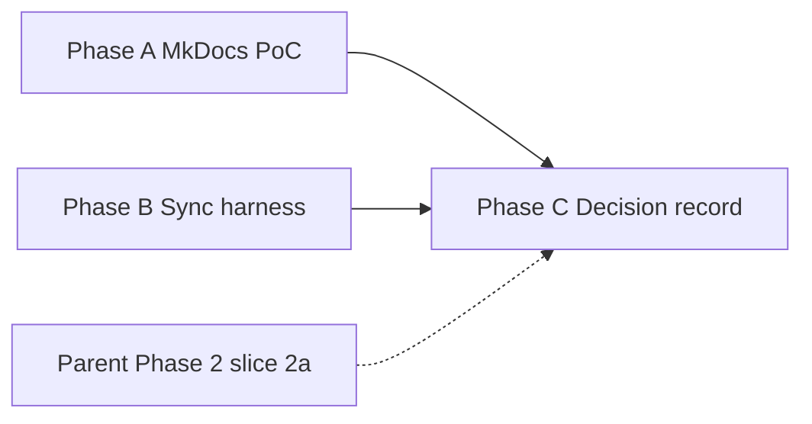

# User docs platform pilot and sync harness plan

**Created:** 2026-09-11  
**Last updated:** 2026-09-11  
**Status:** Not started  
**Priority:** P2 (Next up slot 3)  
**Parent plan:** [Documentation workflow and freshness](DOCUMENTATION_WORKFLOW_AND_FRESHNESS_PLAN.md) — implements Phase 3 pilot, one enforcement gap, and the platform decision record for Phase 4–5.  
**TO_DO ref:** Next up slot 3; [Documentation](#documentation) (user-facing completeness).

---

## Goal

Deliver **professional, navigable end-user documentation** without weakening the
repository's accuracy controls. Canonical sources stay in-repo Markdown and
in-app HTML; any site generator is **generated output only**.

This plan bundles three related workstreams that were discussed together:

1. **MkDocs Material proof of concept** — local static site from existing
   `user-docs/` with search, sidebar nav, and offline preview.
2. **Docs-impact sync harness** — advisory automation so UI/help changes surface
   missing documentation updates before merge.
3. **Platform decision record** — written adopt/defer/reject outcome after the
   pilot (MkDocs vs Mintlify vs status quo), including privacy and offline
   bundle implications.

Human review remains authoritative for user-facing claims. No third-party
documentation GitHub App on this application repository.

---

## Constraints (non-negotiable)

1. **Do not migrate or delete** canonical Markdown under `user-docs/` during the
   pilot; generated `site/` output is disposable until adoption.
2. **Privacy:** no connection of this repo to hosted doc builders (Mintlify,
   GitBook, etc.) until scope, permissions, retention, and data handling are
   reviewed and explicitly approved. If Mintlify is piloted later, use a
   **documentation-only mirror repository** per the parent plan's Mintlify scope
   rule.
3. **Existing gates stay:** `check_user_docs_links.py` remains blocking CI;
   new checks start **advisory** until false-positive rates are reviewed.
4. **In-app Help parity:** `resources/help/quick_start_guide.html` and
   `doc_urls.py` remain first-class mirrors; the pilot must not orphan them.

---

## Current baseline

| Asset | Role |
|-------|------|
| `user-docs/*.md` (12 topic guides) | Canonical end-user Markdown |
| `resources/help/quick_start_guide.html` | Canonical in-app Quick Start (DOC-03) |
| `scripts/check_user_docs_links.py` | Blocking link + `src/` path check (CI) |
| `scripts/check_doc_feature_coverage.py` | QAction → doc mention heuristic (report-only) |
| `scripts/check_documentation_freshness.py` | Inventory/triage/assessment age (advisory CI) |
| `tests/test_doc_urls_resolve.py` | Help filenames + Quick Start `{doc_*}` placeholders |

Feature-coverage report: **99.1%** (only **Exit** intentionally omitted).
Phase 2 slice **2a** (eight user-facing inventory rows needing a running UI)
remains open in the parent plan — complete in parallel, not blocked by this
pilot.

---

## Phase A — MkDocs Material proof of concept

**Implements:** parent plan [Phase 3 — Local static documentation pilot](DOCUMENTATION_WORKFLOW_AND_FRESHNESS_PLAN.md#phase-3--local-static-documentation-pilot).

Work in an **isolated worktree or branch**; do not rewrite source guides until
navigation structure is approved.

### A1. Scaffold (read-only pilot)

- [ ] Add `mkdocs.yml` at repo root (or `docs/mkdocs.yml` if preferred) with:
  - `site_name`, repo URL, edit-uri pointing at `user-docs/` paths.
  - **Navigation** mirroring the hub Topics table in `USER_GUIDE.md` (Getting
    started, Layouts, Shortcuts, Configuration, MPR, 3D, Fusion, Export, Tags,
    Anonymization, QA/pylinac, technical fusion doc as appendix or excluded).
  - MkDocs Material theme: search, tabs, dark mode, table of contents depth.
- [ ] Pin doc-build dependencies in `requirements-dev.txt` only (`mkdocs`,
  `mkdocs-material`); document local preview command in this plan's
  Verification section.
- [ ] Confirm `user-docs/` cross-links render without broken anchors; run
  `python scripts/check_user_docs_links.py` after any nav/path tweaks.

### A2. Evaluate pilot quality

- [ ] Local preview: sidebar discoverability, full-text search, mobile width,
  code blocks, and heading hierarchy vs flat GitHub rendering.
- [ ] **Offline bundle:** `mkdocs build` → static `site/`; open `index.html`
  via `file://` or serve locally; note any assets that require network.
- [ ] Accessibility spot-check (heading order, contrast in dark mode, keyboard
  nav to search).
- [ ] Estimate maintainer cost: edit workflow, build time, release packaging
  hook (feeds TO_DO offline-bundle item).

### A3. Pilot exit artifact

- [ ] Write a short **pilot result** section at the bottom of this plan (or a
  dated note in `dev-docs/doc-assessments/`) with screenshots paths under
  `tmp/` only — **never commit PHI screenshots**.
- [ ] Recommendation: **adopt MkDocs locally**, **defer**, or **needs different
  presentation** (triggers Phase C Mintlify evaluation).

**Exit:** pilot builds reproducibly; recommendation recorded; pilot config
either removed or retained behind explicit adoption decision (Phase C).

---

## Phase B — Docs-impact sync harness

**Implements:** parent plan [Enforcement gaps — docs-impact report](DOCUMENTATION_WORKFLOW_AND_FRESHNESS_PLAN.md#enforcement-gaps-to-build) and feature-coverage PR surfacing.

### B1. `scripts/check_docs_impact.py` (new)

- [ ] Inspect `git diff` (staged or `origin/main...HEAD`) for paths that imply
  user-visible documentation risk, for example:
  - `src/gui/`, `src/main_app_*.py`, `main_window_menu_builder.py`
  - `src/utils/config/`, shortcut registration, export/privacy dialogs
  - `resources/help/`, `src/utils/doc_urls.py`
- [ ] When matched, require **either**:
  - a change under `user-docs/`, `resources/help/`, or `CHANGELOG.md` (user-visible), **or**
  - an explicit PR-body declaration: `docs-impact: not needed — <reason>`
    (parse from `GITHUB_PR_BODY` in CI or `--pr-body-file` locally).
- [ ] Exit **0** with warnings by default; optional `--strict` for local/pre-push
  use after false-positive review.
- [ ] Add `tests/test_check_docs_impact.py` with synthetic diffs.

### B2. Feature-coverage on UI changes

- [ ] When Phase B1 triggers on UI paths, also run
  `check_doc_feature_coverage.py` and print uncovered action labels (no blanket
  `--fail-under` threshold).
- [ ] Wire into CI as a **non-blocking** step (or PR comment when available);
  mirror pattern of advisory `check_documentation_freshness.py`.

### B3. Harness documentation

- [ ] Document commands in [`HARNESS.md`](../../HARNESS.md) and
  [`dev-docs/README.md`](../../README.md#quality-checks-documentation).
- [ ] Add PR template reminder cross-link if not already satisfied by B1's
  `docs-impact` convention.
- [ ] Add tool to `security/security-tool-inventory.json` only if the check
  invokes external services (it should not).

### B4. Optional follow-up (not required for this plan's exit)

- [ ] Shortcut parity script: compare `USER_GUIDE_SHORTCUTS.md` tables to
  registered shortcuts in code.
- [ ] Promote `check_documentation_freshness.py --strict` after parent plan
  Phase 2 clears unowned `Baseline` rows.

**Exit:** advisory docs-impact check runs in CI on relevant diffs; tests green;
maintainers know the `docs-impact:` escape hatch.

---

## Phase C — Platform decision record

**Implements:** parent plan [Phase 4–5 adoption gate](DOCUMENTATION_WORKFLOW_AND_FRESHNESS_PLAN.md#phase-4--conditional-externalgenerative-tool-evaluation) in minimal form.

After Phase A pilot and Phase B harness land, record an evidence-backed decision:

### C1. Decision matrix

| Criterion | MkDocs Material (local) | Mintlify (hosted, docs-only repo) | Status quo (Markdown + in-app HTML) |
|-----------|-------------------------|-----------------------------------|-------------------------------------|
| Professional appearance | Good | Excellent | Adequate in GitHub / plain files |
| Offline / bundled in installer | Strong | Weaker; export-dependent | Strong for HTML; weak for full guide set |
| Privacy / repo access | No external access | Requires review + separate repo | No external access |
| Maintainer cost | Low (pip, local build) | Medium (sync + hosted pipeline) | Lowest |
| Search / nav | Strong | Strong | Weak without a viewer |

### C2. Record outcome

- [ ] Add a **Platform decision** section to this plan (or a subsection in the
  parent plan) with: **adopt / defer / reject** per candidate, owner, and next
  action.
- [ ] If **MkDocs adopted:** add offline bundle step to release docs
  (`BUILDING_EXECUTABLES.md`); keep generated `site/` gitignored.
- [ ] If **Mintlify deferred:** document trigger to re-evaluate (e.g. after
  first public release or when a docs-only mirror repo is approved).
- [ ] Update Next up slot 3 and parent plan Phase 3/4 checkboxes accordingly.

**Exit:** written decision linked from `TO_DO.md` and parent workflow plan; no
ambiguous "still evaluating" state.

---

## Sequencing



- **Phase A and B can proceed in parallel** (different files; no conflict).
- **Phase C** requires A's pilot artifact and B's harness at least at advisory
  CI wiring; parent Phase 2 slice 2a can continue in parallel but should be
  noted in the decision if accuracy gaps remain.

---

## Verification

```bash
# After any user-docs or harness change
python scripts/check_user_docs_links.py
python scripts/check_doc_feature_coverage.py
python -m pytest tests/test_user_docs_links.py tests/test_doc_urls_resolve.py -q

# Phase A (from repo root, after pip install -r requirements-dev.txt)
mkdocs serve    # local preview
mkdocs build    # offline site/ artifact

# Phase B
python scripts/check_docs_impact.py
python -m pytest tests/test_check_docs_impact.py -q
```

Before adopting MkDocs in CI or release packaging: update
`security/security-tool-inventory.json` if required and run
`python scripts/check_security_tool_inventory.py`.

---

## Completion criteria

- [ ] Phase A pilot result recorded; MkDocs builds from current `user-docs/`
      without moving canonical sources.
- [ ] Phase B `check_docs_impact.py` merged with tests and advisory CI step.
- [ ] Phase C platform decision recorded (MkDocs / Mintlify / status quo).
- [ ] `HARNESS.md`, `dev-docs/README.md`, and parent workflow plan cross-links
      updated.
- [ ] Next up slot 3 in `TO_DO.md` updated to point at this plan's status.

When all criteria are met, archive or narrow this plan per
[`TO_DO.md`](../TO_DO.md) tracking rules and continue standing freshness
practice in the parent plan.
